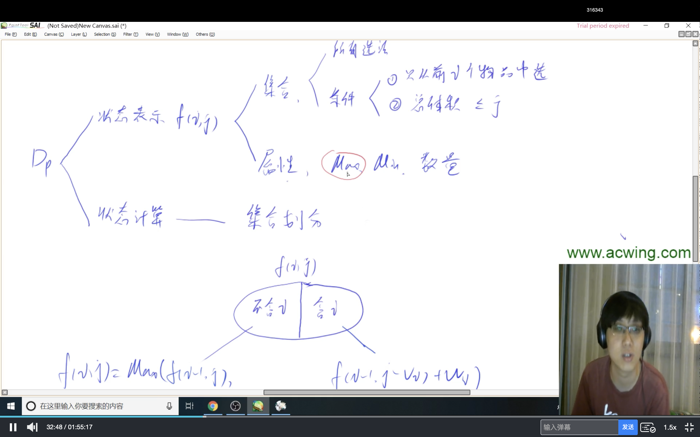
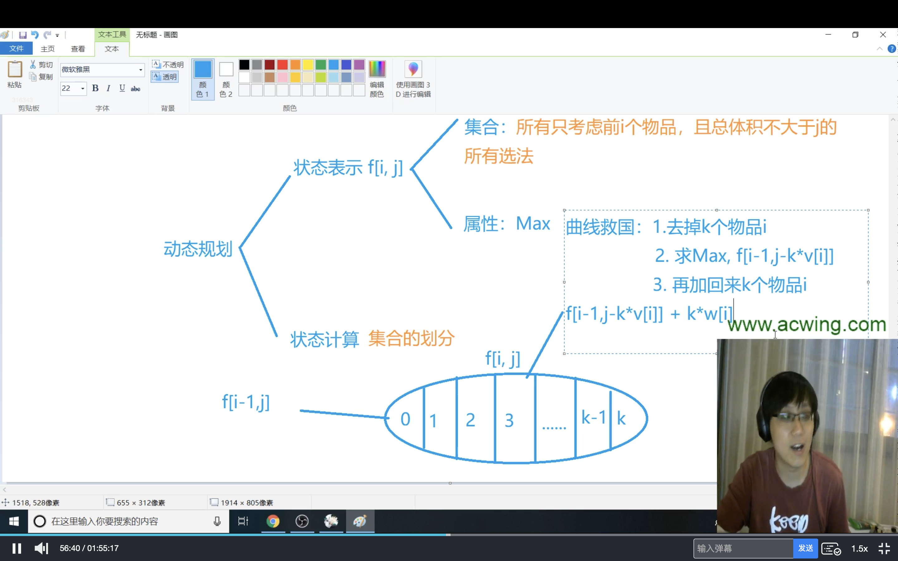
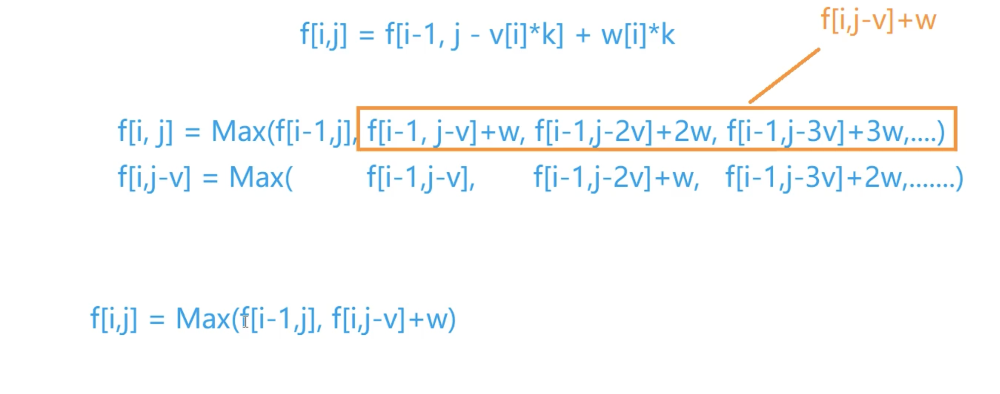

# 并查集

为了能让你们了解并查集，我举一个简单的例子

话说江湖上散落着各式各样的大侠，有上千个之多。他们没有什么正当职业，整天背着剑在外面走来走去，碰到和自己不是一路人的，就免不了要打一架。但大侠们有一个优点就是讲义气，绝对不打自己的朋友。而且他们信奉“朋友的朋友就是我的朋友”，只要是能通过朋友关系串联起来的，不管拐了多少个弯，都认为是自己人。这样一来，江湖上就形成了一个一个的帮派，通过两两之间的朋友关系串联起来。而不在同一个帮派的人，无论如何都无法通过朋友关系连起来，于是就可以放心往死了打。

p3367

------

## 初始化

在江湖上，有非常多的英雄，我们不妨用一个f*f*数组来保存每位英雄的掌门。

```cpp
const int X = 10010;
int f[X];
```

在帮派中，有掌门和弟子，那么刚刚开始肯定都是一个人行走江湖，所以在程序初始化的时候，每个人的掌门都是他们自己。

```cpp
void init(){
	for(int i = 0;i <= X - 1;i++){
		f[i] = i;
	}
}
```

## 查找根节点

我们在判断两位英雄是否师出同门的时候，要用到查找掌门的函数。

这里我们用了记忆化，俗称“压缩路径”。

```cpp
int find_f(int x){
	if(x != f[x]){
		return f[x] = find_f(f[x]);
    //在递归的时候，就直接将遇到的当前帮派的英雄的掌门修改了
	}
	return f[x];//如果找到了掌门，就直接返回掌门编号
}
```

## 合并子集

在确认两位英雄是属于同一个帮派的时候，要把两位英雄的帮派合并，既然师出同门，那两个帮派就是一样的了嘛。

```cpp
void join(int x,int y){
	int fx = find_f(x),
    	fy = find_f(y);//找到两位英雄的掌门
	if(fx != fy){
		f[fy] = fx;//合并子集
	}
}
```

## 主函数

接下来就是整个完整的程序。

```cpp
#include<bits/stdc++.h>
using namespace std;
const int X = 10010;
int f[X];
int n,m;

void init(){
	for(int i = 0;i <= X - 1;i++){
		f[i] = i;
	}
}

int find_f(int x){
	if(x != f[x]){
		return f[x] = find_f(f[x]);
	}
	return f[x];
}

void join(int x,int y){
	int fx = find_f(x),fy = find_f(y);
	if(fx != fy){
		f[fy] = fx;
	}
}

int main(){
	init();
	cin>>n>>m;
	while(m--){
		int t,x,y;
		cin>>t>>x>>y;
		switch(t){
			case 1:
				join(x,y);
				break;
			case 2:
				find_f(x) == find_f(y)?cout<<"Y"<<endl:cout<<"N"<<endl;
                //请注意，这里判断是否为同一个帮派(集合)时要再次找掌门(根节点)
				break;
		}
	}
	return 0;
}
```

可能有些人不太理解这一行：

```cpp
find_f(x) == find_f(y)?cout<<"Y"<<endl:cout<<"N"<<endl;
```

这行相当于

```cpp
if(find_f(x) == find_f(y)){
	cout<<"Y"<<endl;
}
else{
	cout<<"N"<<endl;
}
```

# 动态规划




## 0-1背包问题

二维：

```cpp
#include<iostream>
#include<algorithm>
using namespace std;
 
const int N = 1010;
int n,m;//物品的数量，背包容量
int v[N],w[N];//物品的体积和价值
int f[N][N];//物品状态
int main(){
  cin>>n>>m;
  for(int i=1;i<=n;i++) cin>>v[i]>>w[i];//读入物品状态
 // f[0][0~m]=0 一件物品也没有
 //因为初始化的数组都是0，所以这种情况可以直接不用写，for循环从1开始写
  for(int i=1;i<=n;i++){
    for(int j=0;j<=m;j++){
      f[i][j] = f[i-1][j];//不含i的情况
      if(j>=v[i]){
        //背包起码要装得下第i件物品才能有右边的情况
        f[i][j] = max(f[i][j],f[i-1][j-v[i]]+w[i]);
      }
    }
  }
  cout<<f[n][m]<<endl;
  return 0;
}
```

一维

```c++
#include<iostream>
using namespace std;
/*
把二维的删成一维的，但 f[i][j] = max(f[i][j],f[i-1][j-v[i]]+w[i])
这一步会出问题，直接删掉的话会变成 f[j] = max(f[j],f[j-v[i]]+w[i])
实际计算的是 f[i][j] = max(f[i][j],f[i][j-v[i]]+w[i])
所以需要更改内层for循环的顺序，使当前的f[j-v[i]]+w[i]]是未更新过的，也就是原来的f[i-1][j-v[i]]+w[i]
*/
const int N = 1010;
int n,m;//物品的数量，背包容量
int v[N],w[N];//物品的体积和价值
int f[N];//物品状态

int main(){
  cin>>n>>m;
  for(int i=1;i<=n;i++){
    cin>>v[i]>>w[i];
  }
  for(int i=1;i<=n;i++){
    for(int j=m;j>=v[i];j--){
      //简化了原来的if条件判断
      f[j] = max(f[j],f[j-v[i]]+w[i]);
    }
  }
  cout<<f[m]<<endl;
  return 0;
}
```

## 完全背包问题

有N件物品和一个最多能背重量为W的背包。第i件物品的重量是weight[i]，得到的价值是value[i] 。**每件物品都有无限个（也就是可以放入背包多次）**，求解将哪些物品装入背包里物品价值总和最大。

**完全背包和01背包问题唯一不同的地方就是，每种物品有无限件**。

//按每个物品选k个划分集合



```
f[i][j] = f[i-1,j-v[i]*k] + w[i]*k
```

朴素算法代码实现：会超时的！三重循环花了太长时间了

```c++
#include<iostream>
#include<algorithm>
using namespace std;
const int N = 1010;
int n,m;//物品数，背包总容量
int v[N],w[N];//体积，价值
int f[N][N];//状态

int main(){
  cin>>n>>m;
  for(int i=1;i<=n;i++) cin>>v[i]>>w[i];
  
  for(int i=1;i<=n;i++)
    for(int j=0;j<=m;j++)
      for(int k=0;k*v[i]<=j;k++){
        //k不能无限大，k倍的物品体积要小于背包容量
        f[i][j] = max(f[i][j],f[i-1][j-v[i]*k]+w[i]*k);//状态转移方程
      }
  cout<<f[n][m]<<endl;
  return 0;
}
```

优化一下：



观察一下发现f [i] [j] 后面的情况和f [i] [j-v] 是差不多的，只差了一个w，所以只需要枚举两个状态就可以找到最大值，有点类似于0-1背包的状态转移方程

```c++
0-1:f[i][j] = max(f[i][j],f[i-1][j-v[i]]+w[i]);
//0-1背包的状态转移是从i-1转移过来的
```

修改代码后：

```c++
#include<iostream>
#include<algorithm>
using namespace std;
const int N = 1010;
int n,m;//物品数，背包总容量
int v[N],w[N];//体积，价值
int f[N][N];//状态

int main(){
  cin>>n>>m;
  for(int i=1;i<=n;i++) cin>>v[i]>>w[i];
  
  for(int i=1;i<=n;i++)
    for(int j=0;j<=m;j++){
      f[i][j] = f[i-1][j];
      if(j>=v[i]) f[i][j] = max(f[i][j],f[i][j-v[i]]+w[i]);
    }
      
  cout<<f[n][m]<<endl;
  return 0;
}
```

变成一维：删掉i的这一维，完全背包问题的**终极写法**

```c++
#include<iostream>
#include<algorithm>
using namespace std;
const int N = 1010;
int n,m;//物品数，背包总容量
int v[N],w[N];//体积，价值
int f[N];//状态

int main(){
  cin>>n>>m;
  for(int i=1;i<=n;i++) cin>>v[i]>>w[i];
  
  for(int i=1;i<=n;i++)
    for(int j=v[i];j<=m;j++){
      //f[j] = f[j];删掉一维之后是恒等式，直接删了
      //if(j>=v[i]) 直接写在for条件里面了
      f[j] = max(f[j],f[j-v[i]]+w[i]);
      /*
      不需要像0-1背包那样更改循环的顺序
      因为j-v[i]<j，所以这一步里面它已经更新过了，是f[i][j-v[i]]+w[i]
      和原来二维时候的状态转移方程是一样的
      */
    }
      
  cout<<f[m]<<endl;
  return 0;
}
```

## 多重背包问题

有 N 种物品和一个容量是 V 的背包。

第 i 种物品最多有 si 件，每件体积是 vi，价值是 wi。

求解将哪些物品装入背包，可使物品体积总和不超过背包容量，且价值总和最大。


```c++
//状态转移方程
f[i][j] = max(f[i][j],f[i-1][j-v[i]*k]+w[i]*k);
k = 0,1,2,3……s[i]
```

朴素写法代码：

```c++
#include<iostream>
#include<algorithm>
using namespace std;

const int N = 110;
int n,m;
int v[N],w[N],s[N];
int f[N][N];

int main(){
  cin>>n>>m;
  for(int i=1;i<=n;i++) cin>>v[i]>>w[i]>>s[i];
  
  for(int i=1;i<=n;i++)
    for(int j=0;j<=m;j++)
      for(int k=0;k<=s[i]&&k*v[i]<=j;k++)
        f[i][j] = max(f[i][j],f[i-1][j-v[i]*k]+w[i]*k);
  cout<<f[n][m]<<endl;
  return 0;
}
```

二进制优化：

假设 s[ i ] = 1023
 0，1，2，3，……，1023
现在把它们按照2的幂次进行分组打包，每组的数量为：
1 ，2 ，4 ，8 ，…… ，512
这里面的数可以枚举出来0～1023内的任意一种情况，
比如1，2可以枚举0～3
加上4，可以枚举4～7，也就是可以枚举0～7
加上8，可以枚举8～15，也就是可以枚举0～15
以此类推，可以得到所有的数

每一个打包起来的第i个物品，可以看成0-1背包里面的一个物品（因为只能选一次），相当于我们用10个新的物品 选or 不选，替代了原来的第i个物品的所有方案

枚举1024次-->枚举10次( $log_2n$)


从1一直加到$2^k$不超过s的最大的k，c是一个补的数，因为如果再来一个2的k+1次就有可能会超出s的范围

代码:

```c++
#include<iostream>
using namespace std;
#include<algorithm>

const int N = 25000,M = 2010;

int n,m;
int v[N],w[N];
int f[N];

int main(){
  cin>>n>>m;
  
  int cnt = 0;//表示所有新的物品编号
  for(int i=1;i<=n;i++){
    int a,b,s;//物品的体积、价值、个数
    cin>>a>>b>>s;
    int k=1;
    while(k<=s){
      //k<=s就可以分
      //每次把k个第i个物品打包到一起
      cnt++;
      v[cnt] = a*k;
      w[cnt] = b*k;
      s -= k;
      k *= 2;
    }
    //如果需要补c
    //此时的s是剩下的，也就是刚才的c
    if(s>0){
      cnt ++;
      v[cnt] = a*s;
      w[cnt] = b*s;
    }
  }
  n = cnt;
  for(int i=1;i<=n;i++)
    for(int j=m;j>=v[i];j--)
      f[j] = max(f[j],f[j-v[i]]+w[i]);
  cout<<f[m]<<endl;
  return 0;
}
```


## 分组背包问题

有 N 组物品和一个容量是 V 的背包。

每组物品有若干个，同一组内的物品最多**只能选一个**。
每件物品的体积是 vij，价值是 wij，其中 i 是组号，j 是组内编号。

求解将哪些物品装入背包，可使物品总体积不超过背包容量，且总价值最大。


代码：

```c++
#include<iostream>
using namespace std;
#include<algorithm>

const int N = 110;
int n,m;
int v[N][N],w[N][N],s[N];//s存的是个数
int f[N];

int main(){
  cin>>n>>m;
  
  for(int i = 1;i <= n;i++){
    cin>>s[i];
    for(int j = 0;j < s[i]; j++)
      cin>>v[i][j]>>w[i][j];
  }
  for(int i = 1;i <= n;i++)
    for(int j = m;j >= 0;j--)
      for(int k = 0;k < s[i];k++)
        if(v[i][k] <= j)
          f[j] = max(f[j],f[j-v[i][k]]+w[i][k]);
  //枚举每一种情况，并且需要v[i][k] <= j才更新
  cout<<f[m]<<endl;
  return 0;
}
```

石子合并：

```c++
#include<iostream>
using namespace std;

const int N = 301;
int n;
int s[N];//前缀和
int f[N][N];//状态数

int main(){
  cin>>n;
  for(int i=1;i<=n;i++) cin>>s[i],s[i] += s[i-1];
  
  for(int len = 2;len<=n;len++)
    for(int i=1;i+len-1<=n;i++){
      int j = i+len-1;
      f[i][j] = 1e8;
      for(int k=i;k<j;k++){
        f[i][j] = min(f[i][j],f[i][k]+f[k+1][j]+s[j]-s[i-1]);
      }
    }
  cout<<f[1][n]<<endl;
  return 0;
}
```


树状dp-没有上司的舞会：

```c++
#include <cstring>
#include <iostream>
#include <algorithm>

using namespace std;

const int N = 6010;

int n;
int h[N], e[N], ne[N], idx;
int happy[N];//每个人的高兴度
int f[N][2];//所有状态，0表示不选，1表示选
bool has_fa[N];//看是否有父节点
//临接表插入边
void add(int a, int b)
{
    e[idx] = b, ne[idx] = h[a], h[a] = idx ++ ;
}

void dfs(int u)
{
    f[u][1] = happy[u];//选这个点，加上高兴度
		//枚举一下u的所有儿子
    for (int i = h[u]; i != -1 ; i = ne[i])
    {
        int j = e[i];
        dfs(j);

        f[u][1] += f[j][0];
        f[u][0] += max(f[j][0], f[j][1]);
    }
}

int main()
{
    scanf("%d", &n);

    for (int i = 1; i <= n; i ++ ) scanf("%d", &happy[i]);

    memset(h, -1, sizeof h);
    for (int i = 0; i < n - 1; i ++ )
    {
        int a, b;
        scanf("%d%d", &a, &b);//b是a的父节点
        add(b, a);
        has_fa[a] = true;
    }

    int root = 1;
    while (has_fa[root]) root ++ ;

    dfs(root);

    printf("%d\n", max(f[root][0], f[root][1]));//选/不选根节点的最大值

    return 0;
}


```


# 字符串kmp

模板

```c++
#include<iostream>
using namespace std;
const int N=1000006;
int ne[N];
string a,b;//b是匹配串
int la,lb;
//kmp求匹配串的next数组
void get_next(){
    for(int i=2,j=0;i<=lb;i++){
        while(j && b[i] != b[j+1]) j = ne[j];
        if(b[i] == b[j+1]) j++;
        ne[i] = j;
    }
}
int main(){
    cin>>a>>b;
    //串的长度
    la = a.size();
    lb = b.size();
    //字符串数组要从1开始
    a = '#'+a;
    b = '#'+b;
    //求next数组
    get_next();
    //匹配
    for(int i=1,j=0;i<=la;i++){
        while(j && a[i] != b[j+1]) j=ne[j];
        if(a[i] == b[j+1]) j++;
        if(j==lb){
            cout<< i-lb+1 <<endl;
        }
    }
    //输出next数组
    for(int i=1;i<=lb;i++){
        cout<<ne[i]<<" "[i==la];
    }
}

```

