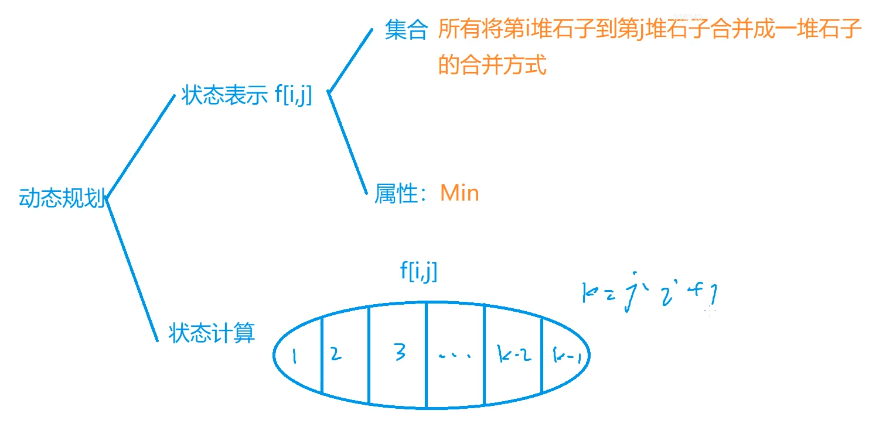
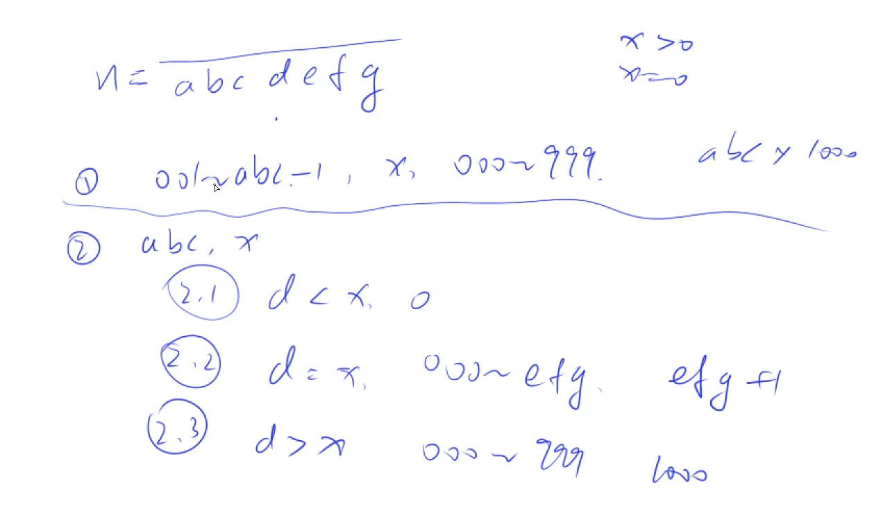

# 背包问题

背包问题及其特点：

0-1背包：每种物品只能用一次

完全背包：每种物品有无数个

多重背包：每个物品的个数不一样

分组背包：物品有n组，每组物品有若干种，一组里面最多选一种

## 0-1背包问题


N个物品，容量是V的背包，每个物品有体积Vi，价值Wi。每一个物品只能用一次。求背包能装下的价值之和最大是多少。

二维：

```C++
 #include<iostream>
 #include<algorithm>
 using namespace std;
  
 const int N = 1010;
 int n,m;//物品的数量，背包容量
 int v[N],w[N];//物品的体积和价值
 int f[N][N];//物品状态
 int main(){
   cin>>n>>m;
   for(int i=1;i<=n;i++) cin>>v[i]>>w[i];//读入物品状态
  // f[0][0~m]=0 一件物品也没有
  //因为初始化的数组都是0，所以这种情况可以直接不用写，for循环从1开始写
   for(int i=1;i<=n;i++){
     for(int j=0;j<=m;j++){
       f[i][j] = f[i-1][j];//不含i的情况
       if(j>=v[i]){
         //背包起码要装得下第i件物品才能有右边的情况
         f[i][j] = max(f[i][j],f[i-1][j-v[i]]+w[i]);
      }
    }
  }
   cout<<f[n][m]<<endl;
   return 0;
 }
```

一维：
把二维的删成一维的，但 f[i][j] = max(f[i][j],f[i-1][j-v[i]]+w[i])
这一步会出问题，直接删掉的话会变成 f[j] = max(f[j],f[j-v[i]]+w[i])
实际计算的是 f[i][j] = max(f[i][j],f[i][j-v[i]]+w[i])
所以需要更改内层for循环的顺序，使当前的f[j-v[i]]+w[i]]是未更新过的，
也就是原来的f[i-1][j-v[i]]+w[i]

```C++
 #include<iostream>
 using namespace std;
 /*
 把二维的删成一维的，但 f[i][j] = max(f[i][j],f[i-1][j-v[i]]+w[i])
 这一步会出问题，直接删掉的话会变成 f[j] = max(f[j],f[j-v[i]]+w[i])
 实际计算的是 f[i][j] = max(f[i][j],f[i][j-v[i]]+w[i])
 所以需要更改内层for循环的顺序，使当前的f[j-v[i]]+w[i]]是未更新过的，也就是原来的f[i-1][j-v[i]]+w[i]
 */
 const int N = 1010;
 int n,m;//物品的数量，背包容量
 int v[N],w[N];//物品的体积和价值
 int f[N];//物品状态
 
 int main(){
   cin>>n>>m;
   for(int i=1;i<=n;i++){
     cin>>v[i]>>w[i];
  }
   for(int i=1;i<=n;i++){
     for(int j=m;j>=v[i];j--){
       //简化了原来的if条件判断
       f[j] = max(f[j],f[j-v[i]]+w[i]);
    }
  }
   cout<<f[m]<<endl;
   return 0;
 }
```

## 完全背包问题

有N件物品和一个最多能背重量为W的背包。第i件物品的重量是weight[i]，得到的价值是value[i]，**每件物品都有无限个（也就是可以放入背包多次）**，求解将哪些物品装入背包里物品价值总和最大。

**完全背包和01背包问题唯一不同的地方就是，每种物品有无限件**。

//按每个物品选k个划分集合


```C++
 f[i][j] = f[i-1,j-v[i]*k] + w[i]*k
```

朴素算法代码实现：会超时的！三重循环花了太长时间了

```C++
 #include<iostream>
 #include<algorithm>
 using namespace std;
 const int N = 1010;
 int n,m;//物品数，背包总容量
 int v[N],w[N];//体积，价值
 int f[N][N];//状态
 
 int main(){
   cin>>n>>m;
   for(int i=1;i<=n;i++) cin>>v[i]>>w[i];
   
   for(int i=1;i<=n;i++)
     for(int j=0;j<=m;j++)
       for(int k=0;k*v[i]<=j;k++){
         //k不能无限大，k倍的物品体积要小于背包容量
         f[i][j] = max(f[i][j],f[i-1][j-v[i]*k]+w[i]*k);//状态转移方程
      }
   cout<<f[n][m]<<endl;
   return 0;
 }
```

优化一下：


观察一下发现f [i] [j] 后面的情况和f [i] [j-v] 是差不多的，只差了一个w，所以只需要枚举两个状态就可以找到最大值，有点类似于0-1背包的状态转移方程


```C++
 0-1:f[i][j] = max(f[i][j],f[i-1][j-v[i]]+w[i]);
 //0-1背包的状态转移是从i-1转移过来的
```

修改代码后：

```C++
 #include<iostream>
 #include<algorithm>
 using namespace std;
 const int N = 1010;
 int n,m;//物品数，背包总容量
 int v[N],w[N];//体积，价值
 int f[N][N];//状态
 
 int main(){
   cin>>n>>m;
   for(int i=1;i<=n;i++) cin>>v[i]>>w[i];
   
   for(int i=1;i<=n;i++)
     for(int j=0;j<=m;j++){
       f[i][j] = f[i-1][j];
       if(j>=v[i]) f[i][j] = max(f[i][j],f[i][j-v[i]]+w[i]);
    }
       
   cout<<f[n][m]<<endl;
   return 0;
 }
```

变成一维：删掉i的这一维，完全背包问题的**终极写法**

```C++
 #include<iostream>
 #include<algorithm>
 using namespace std;
 const int N = 1010;
 int n,m;//物品数，背包总容量
 int v[N],w[N];//体积，价值
 int f[N];//状态
 
 int main(){
   cin>>n>>m;
   for(int i=1;i<=n;i++) cin>>v[i]>>w[i];
   
   for(int i=1;i<=n;i++)
     for(int j=v[i];j<=m;j++){
       //f[j] = f[j];删掉一维之后是恒等式，直接删了
       //if(j>=v[i]) 直接写在for条件里面了
       f[j] = max(f[j],f[j-v[i]]+w[i]);
       /*
       不需要像0-1背包那样更改循环的顺序
       因为j-v[i]<j，所以这一步里面它已经更新过了，是f[i][j-v[i]]+w[i]
       和原来二维时候的状态转移方程是一样的
       */
    }
       
   cout<<f[m]<<endl;
   return 0;
 }
```

## 多重背包问题

有 N 种物品和一个容量是 V 的背包。

第 i 种物品最多有 Si 件，每件体积是 Vi，价值是 Wi。    

求解将哪些物品装入背包，可使物品体积总和不超过背包容量，且价值总和最大。


```C++
 //状态转移方程
 f[i][j] = max(f[i][j],f[i-1][j-v[i]*k]+w[i]*k);
 k = 0,1,2,3……s[i]
```

朴素写法代码：

```C++
 #include<iostream>
 #include<algorithm>
 using namespace std;
 
 const int N = 110;
 int n,m;
 int v[N],w[N],s[N];
 int f[N][N];
 
 int main(){
   cin>>n>>m;
   for(int i=1;i<=n;i++) cin>>v[i]>>w[i]>>s[i];
   
   for(int i=1;i<=n;i++)
     for(int j=0;j<=m;j++)
       for(int k=0;k<=s[i]&&k*v[i]<=j;k++)
         f[i][j] = max(f[i][j],f[i-1][j-v[i]*k]+w[i]*k);
   cout<<f[n][m]<<endl;
   return 0;
 }
```

二进制优化：

假设 s[ i ] = 1023 0，1，2，3，……，1023 现在把它们按照2的幂次进行分组打包，每组的数量为： 1 ，2 ，4 ，8 ，…… ，512 这里面的数可以枚举出来0～1023内的任意一种情况， 比如1，2可以枚举0～3 加上4，可以枚举4～7，也就是可以枚举0～7 加上8，可以枚举8～15，也就是可以枚举0～15 以此类推，可以得到所有的数


每一个打包起来的第i个物品，可以看成0-1背包里面的一个物品（因为只能选一次），相当于我们用10个新的物品 选or 不选，替代了原来的第i个物品的所有方案则枚举1024次-->枚举10次( logn )


k是从1一直加到 2^k （也就是2^(k+1) -1）不超过s的最大的k，c是一个补的数，因为如果再来一个 2^k+1 就有可能会超出s的范围而当前又无法完全凑出来s，c就是s与2的k+1次方再减一的差


代码:

```C++
 #include<iostream>
 using namespace std;
 #include<algorithm>
 
 const int N = 25000,M = 2010;
//一共1000件物品，si最大是2000
//所以一件物品最多打包成log2000，所以问题规模开成25000>1000*log2000
 
 int n,m;
 int v[N],w[N];
 int f[N];
 
 int main(){
   cin>>n>>m;
   
   int cnt = 0;//表示所有新的物品编号,也就是打包后的
   for(int i=1;i<=n;i++){
     int a,b,s;//物品的体积、价值、个数
     cin>>a>>b>>s;
     int k=1;
     while(k<=s){
       //k<=s就可以分
       //每次把k个第i个物品打包到一起
       cnt++;
       v[cnt] = a*k;//打包后体积等于k个物品体积和
       w[cnt] = b*k;//价值为k个物品价值和
       s -= k;//物品i下一轮能打包的数量的上限更新为s-k
       k *= 2;//k每次更新为原来二倍
    }
     //如果需要补c
     //此时的s是剩下的，也就是刚才的c
     if(s>0){
       cnt ++;
       v[cnt] = a*s;
       w[cnt] = b*s;
    }
  }
   n = cnt;//将n更新成cnt，二进制优化,n表示打包后物品的个数
   //转成0-1背包问题
   for(int i=1;i<=n;i++)
     for(int j=m;j>=v[i];j--)
       f[j] = max(f[j],f[j-v[i]]+w[i]);
   cout<<f[m]<<endl;
   return 0;
 }
```

## 分组背包问题

有 N 组物品和一个容量是 V 的背包。

每组物品有若干个，同一组内的物品最多**只能选一个**。 每件物品的体积是 v[i] [j]，价值是 w[i] [j]，其中 i 是组号，j 是组内编号。

求解将哪些物品装入背包，可使物品总体积不超过背包容量，且总价值最大。

注意：完全背包问题是枚举第i个物品选几个，而分组背包问题枚举的是第i组物品选哪个

第i组的物品如果不选则相当于f[i-1] [j],如果选择第k个则相当于求解f[i-1,j-v[i,k]]+w[i,k]


代码：

```C++
 #include<iostream>
 using namespace std;
 #include<algorithm>
 
 const int N = 110;
 int n,m;
 int v[N][N],w[N][N],s[N];//s存的是个数
 int f[N];
 
 int main(){
   cin>>n>>m;
   
   for(int i = 1;i <= n;i++){
     cin>>s[i];
     for(int j = 0;j < s[i]; j++)
       cin>>v[i][j]>>w[i][j];
  }
   for(int i = 1;i <= n;i++)//枚举每一组
     for(int j = m;j >= 0;j--)//从大到小枚举所有体积
       for(int k = 0;k < s[i];k++)//枚举所有选择
         if(v[i][k] <= j)//需要v[i][k] <= j才更新
           f[j] = max(f[j],f[j-v[i][k]]+w[i][k]);
   
   cout<<f[m]<<endl;
   return 0;
 }
```


# 线性DP

## 数字三角形


动态规划思路：


注：图中应为右上而不是右下

**动态规划问题时间复杂度计算：状态数量*转移计算量**

```C++
#include<iostream>
#include<algorithm>

using namespace std;

const int N = 510,INF = 1e9;

int n;
int a[N][N];//存储三角形中的元素
int f[N][N];//存状态

int main()
{
    cin >> n;
    //读入元素
    for(int i = 1;i <= n;i ++)
        for(int j = 1;j <= i;j ++)
            scanf("%d",&a[i][j]);
    /*
    初始化，注意这里要多初始化一列，即j<=i+1
    由于三角形最右边的元素没有右上元素
    如果没有初始化判断当前元素是从左上还是右上转移时会出现问题
    此外由于会出现i-1的情况，所有存储时i从1开始初始化i从0开始
    */
    for(int i = 0;i <= n; i ++)
        for(int j = 0;j <= i+1; j ++)
            f[i][j] = -INF;
    
    f[1][1] = a[1][1];//第一个点最大值只能是它本身
    
    //状态转移方程，从顶点下一层开始（第二层）
    for(int i = 2;i <= n;i ++)
        for(int j = 1;j <= i; j ++)
            f[i][j] = max(f[i-1][j-1]+a[i][j],f[i-1][j]+a[i][j]);
     
    int res = -INF;
    //遍历最后一行找最大值
    for(int j = 1;j <= n; j ++) res = max(res,f[n][j]);
    
    cout << res <<endl;
    
   return 0; 
}
```


## 最长上升子序列


从前到后挑数，保证数列严格递增

动态规划思路：


状态计算中按照以位置i上的数为结尾的序列中，i的前一个数的位置划分。显然，位置i前的数并不一定都在序列中。

```C++
#include<iostream>
#include<algorithm>

using namespace std;

const int N = 1010;

int n;
int a[N],f[N];

int main()
{
    scanf("%d",&n);
    for(int i = 1;i <= n; i ++) scanf("%d",&a[i]);//读入序列
    
    for(int i = 1;i <= n; i ++)
    {
        f[i] = 1;//最长序列至少是1，即仅有a[i]
        for(int j = 1;j < i; j ++)
            if(a[j] < a[i])
                f[i] = max(f[i],f[j] + 1);
      //看是否满足【上升】,在满足的序列中取一个最长的加1
    }
    
    int res = 0;
    for(int i = 1;i <= n;i ++) res = max(res,f[i]);
    
    printf("%d\n",res);
    
}
```

如果想要存下来这个序列，则可以额外设置一个g数组，记录下当前点是由哪个点转移过来的,输出序列正好是所求上升序列的逆序列

代码如下：

```C++
#include<iostream>
#include<algorithm>

using namespace std;

const int N = 1010;

int n;
int a[N],f[N],g[N];

int main()
{
    scanf("%d",&n);
    for(int i = 1;i <= n; i ++) scanf("%d",&a[i]);//读入序列
    
    for(int i = 1;i <= n; i ++)
    {
        f[i] = 1;//最长序列至少是1，即仅有a[i]
        g[i] = 0;
        for(int j = 1;j < i; j ++)
            if(a[j] < a[i])
                if(f[i] < f[j] + 1)
                {
                    f[i] = f[j]+1;
                    g[i] = j;
                }
    }
    
    int k = 1;//最长序列中结尾的下标
    for(int i = 1;i <= n;i ++)
        if(f[k]<f[i])
            k = i;
    
    printf("%d\n",f[k]);
    
    for(int i = 0,len = f[k];i < len;i ++)
    {
        printf("%d ",a[k]);
        k = g[k];
    }
    
    return 0;
}
```

输入输出如下：


## 优化版最长上升子序列

示例：3121856

观察3和第一个1，如果序列中有数字可以接到3的后面，由于3>1，则这个数一定可以接到1的后面，但是能接到1的后面未必能接到3的后面，依次来看第一个3并没有继续计算的必要，直接删去并不会影响计算的结果


对子序列集合按照长度进行分类，长度为1的一类，长度为2的一类，依次类推，每一类保留一个结尾数字最小的即可。显然，存下来的序列长度越长，结尾的数字越大


对于当前第i个位置上的元素a，它一定可以接到上述序列所有比自己小的末尾上去，由于序列长度正比于序列末尾值大小，所以若想整体长度最长，a最好接到比它小且最大的序列后面

```C++
#include<iostream>
#include<algorithm>

using namespace std;

const int N = 100010;

int n;
int a[N];//存序列中的数
int q[N];//存依长度划分的序列的结尾元素

int main()
{
    scanf("%d",&n);
    for(int i = 0; i < n;i ++) scanf("%d",&a[i]);//读入序列
    
    int len = 0;//初始长度为0
    for(int i = 0;i < n;i ++)//遍历序列每一个元素
    {
        /*
        用二分法来查找那个最大的小于a[i]的数，然后用它来覆盖他之后的那一个长度的最小值
        举例，如二分查找到的最大的小于a[i]的值是4,而5一定是大于或等于他的,
        此时又因为a[i]加到了长度为4子序列,让他的长度变成了5,
        则此时最小的长度为5的子序列结尾应该就是a[i],那么就得把5的结尾更新成a[i]
        */
        int l = 0,r = len;//r=len保证了二分不会查到当前点后面的小于a[i]的数
        while(l < r)
        {
            int mid = l + r + 1 >> 1;
            if(q[mid] < a[i]) l = mid;
            else r = mid - 1;
        }
        len = max(len,r + 1);
        q[r + 1] = a[i];//更新结尾最小值
    }
    
    printf("%d\n",len);
    
    return 0;
}
```


## 最长公共子序列


一个序列，既是A的字串也是B的字串，且长度最长

动态规划思路：

状态计算中按照a[i] 和 b[j]是否在序列中进行分类，00表示都不在，11表示都在

一般不写00的情况，因为它会包含在后面几种情况之中

01和10的情况是f[i-1] [j] or f[i] [j-1]两种情况集合的其中一个元素


代码：

```C++
#include<iostream>
#include<algorithm>

using namespace std;

const int N = 1010;

int n,m;
char a[N],b[N];//存两个字符串
int f[N][N];//状态

int main()
{
    scanf("%d%d",&n,&m);
    scanf("%s%s",a + 1,b + 1);//由于会出现i-1的情况，下标从1开始
    
    for(int i = 1;i <= n;i ++)
        for(int j = 1; j <= m; j ++)
        {
            f[i][j] = max(f[i-1][j],f[i][j-1]);//11情况不一定存在，先算01和10情况的最大值
            if(a[i] == b[j]) f[i][j] = max(f[i][j],f[i-1][j-1] + 1);
        }   
    printf("%d",f[n][m]);
    return 0;
}
```


## 最短编辑距离


动态规划思路：

状态计算根据最后一步进行的操作进行分类

修改操作中，如果a[i] = b[j] 则不需要加一


代码：

```C++
#include<iostream>
#include<algorithm>

using namespace std;

const int N = 1010;

int n,m;
char a[N],b[N];
int f[N][N];

int main()
{
    scanf("%d%s",&n,a + 1);
    scanf("%d%s",&m,b + 1);
    
    //初始化
    for(int j = 0;j <= m;j ++) f[0][j] = j;//A串中没有元素，B串中j个元素，想要匹配只能j次增加
    for(int i = 0;i <= n;i ++) f[i][0] = i;//A中i个元素，B中没有元素，想要匹配只能i次删除
    
    for(int i = 1;i <= n;i ++)
        for(int j = 1;j <= m;j ++)
        {
            f[i][j] = min(f[i-1][j] + 1,f[i][j-1] + 1);
            if(a[i] == b[j]) f[i][j] = min(f[i][j],f[i-1][j-1]);
            else f[i][j] = min(f[i][j],f[i-1][j-1] + 1);
        }
    printf("%d\n",f[n][m]);
    
    return 0;
}
```

## 编辑距离


代码：

```C++
#include<iostream>
#include<algorithm>
#include<string.h>

using namespace std;

const int N = 15,M = 1010;

int n,m;
char a[N],b[N];
int f[N][N];
char str[M][N];

//最短编辑距离
int edit_distance(char a[],char b[])
{
    int la = strlen(a + 1),lb = strlen(b + 1);
    for(int i = 0;i <= lb;i ++) f[0][i] = i;
    for(int i = 0;i <= la;i ++) f[i][0] = i;
    
    for(int i = 1;i <= la;i ++)
        for(int j = 1;j <= lb;j ++)
        {
            f[i][j] = min(f[i-1][j] + 1,f[i][j-1] + 1);
            if(a[i] == b[j]) f[i][j] = min(f[i][j],f[i-1][j-1]);
            else f[i][j] = min(f[i][j],f[i-1][j-1] + 1);
        }
    return f[la][lb];
}

int main()
{
    scanf("%d%d",&n,&m);
    for(int i = 0;i < n;i ++) scanf("%s",str[i] + 1);//读入字符串
    
    while(m--)
    {
        int limit;
        char s[N];
        scanf("%s%d",s + 1,&limit);
        int res = 0;
        for(int i = 0;i < n;i ++)
            if(edit_distance(str[i],s) <= limit)
                res++;
        
        printf("%d\n",res);
    }
    
    return 0;
}
```

# 区间DP

区间dp问题状态表示的时候一般是某一个区间

## 石子合并


动态规划思路：

状态计算以最后一次分界线的位置来分类



从k处分割代价：


代码：

```C++
#include<iostream>
#include<algorithm>

using namespace std;

const int N = 310,INF = 1e8;

int n;
int s[N];
int f[N][N];

int main()
{
    scanf("%d",&n);
    for(int i = 1;i <= n;i ++) scanf("%d",&s[i]);//读入每堆石子质量
    
    for(int i = 1; i <= n;i ++) s[i] += s[i-1];//前缀和
    
    for(int len = 2;len <= n; len ++)//从小到大枚举区间长度（len=1为边界情况，合并不需要体力）
        for(int i = 1;i + len - 1 <= n;i ++)//枚举区间的起点
        {
            int l = i,r = i + len - 1;//区间左右端点
            f[l][r] = INF;//初始化
            for(int k = l;k < r;k ++)
                f[l][r] = min(f[l][r],f[l][k]+f[k+1][r]+s[r]-s[l-1]);
        }
    
    printf("%d\n",f[1][n]);
    
    return 0;
}
```


# 计数类DP

## 整数划分


解法一：

转化成一个完全背包问题，背包容量是n，物品的体积分别是1到n，每种物品有无限个，问恰好装满背包的方案数


动态规划思路：

集合表示从1-i中选，体积恰好是j的选法的数量

状态计算按最后一个物品i选了多少个划分


优化一下：


观察发现f[i] [j-i]和f[i] [j]后半部分完全相同，因此可以用它替换后半部分

再将二维变成一维，体积从小到大循环

```C++
f[i][j] = f[i-1][j] + f[i][j-1]
f[j] = f[j] + f[j-1]
```

完全背包方法代码：

f[j]表示选择物品体积和是j的所有选法

```C++
#include<iostream>
#include<algorithm>

using namespace std;

const int N = 1010,mod = 1e9+7;

int n;
int f[N];

int main()
{
    cin >> n;
    
    f[0] = 1;//初始化，如果n = 0，则什么数都不选的时候为一种方案
    //否则对于其余数，什么数都不选不可能组成该数，初始值为0
    for(int i = 1;i <= n;i ++)
        for(int j = i;j <= n;j ++)//只有剩余体积j大于物品体积i才有算的必要
            f[j] = (f[j]+f[j-i]) % mod;
            
    cout << f[n] << endl;
    
    return 0;
}

```


解法二：与解法一中的状态表示不相同

状态计算中按照 j 个数组成总和 i 的那 j 个数中的最小值是否为1进行划分

最小值是1的时候，先不考虑这个1，相当于求 f [i-1] [j-1] 的个数，在此基础上加一就可以保证总和是i，所以两者本质上方案数是一样的

最小值大于1的时候，将里面的每一个数减去一，此时每个数仍为正整数。相当于总和变为 i-j ，仍由 j 个数组成


代码：

```C++
#include<iostream>
#include<algorithm>

using namespace std;

const int N = 1010,mod = 1e9+7;

int n;
int f[N][N];

int main()
{
    cin >> n;
    
    f[0][0] = 1;//总和为0，由0个数组成，方案数为1
    
    for(int i = 1;i <= n;i ++)
        for(int j = 1;j <= i;j ++)//和为i则最多由i个数组成(i个1)
            f[i][j] = (f[i - 1][j - 1] + f[i - j][j]) % mod;
    //枚举总和为n，由1~n个数组成的方案数总和
    int ans = 0;
    for(int i = 1;i <= n; i++) ans = (ans+f[n][i]) % mod;
    
    cout << ans << endl;
    
    return 0;
}

```


# 数位统计DP

## 计数问题


题目需要分情况讨论，

求[a,b]中出现0~9的次数，需要实现一个count（n，x）函数，这个函数表示从1~n中出现x的个数，则题目所求转化成求count(b,x) - count(a-1,x)，思想同前缀和

举例：


当枚举情况处于最高位时，情况（1）不存在

对于情况（1），考虑一种边界情况，现在求解0在第四位出现的次数，如果xxx = 000，此时前四位都是0，组成一个数的前导0，实际上并不会被写出来，则xxx应该从001开始计数，此时情况如下：



代码：

```C++
#include<iostream>
#include<algorithm>
#include<cstring>
#include<vector>

using namespace std;

//求情况（1）当前位（d）前所有位构成数的值（abc的值）
int get(vector<int> num,int l,int r)
{
    int res = 0;
    for(int i = l;i >= r;i --) res = res *10 + num[i];
    return res;
}

//求10的x次方
int power10(int x)
{
    int res = 1;
    while(x--) res *= 10;
    return res;
}

//这个函数表示从1~n中出现x的个数
int count(int n,int x)
{
    if(!n) return 0;//n = 0，1~0之间没有数
  
    //存每一位
    vector<int> num;
    while(n)
    {
        num.push_back(n % 10);
        n /= 10;
    }
    
    n = num.size();//n = 位数
    
    int res = 0;//总共出现的次数
    for(int i = n - 1 - !x;i >= 0;i --)//从第一位开始枚举,x = 0时从第二位开始枚举
    {
        if(i < n - 1)//此时情况1才存在
        {
            res += get(num,n - 1,i + 1) * power10(i);
            if(!x) res -= power10(i);
        }
        if(num[i] == x) res += get(num, i - 1, 0) + 1;//情况2.2
        else if(num[i] > x) res += power10(i);//情况2.3
    }
    return res;
}

int main()
{
    int a,b;
    while(cin >> a >> b,a)
    {
        if(a > b) swap(a,b);//给数的顺序不一定是前小后大的
        
        for(int i = 0;i < 10;i ++)
            cout << count(b,i) - count(a - 1,i)<<' ';
        cout << endl;
    }
    
    return 0;
}

```

参考网站上某同学的代码；

```C++
#include <iostream>
#include <cstring>
#include <algorithm>
#include <vector>
using namespace std;
/*

/*/

int get(vector<int> num,int l,int r)//因为我们举的分类中，有需要求出一串数字中某个区间的数字，例如abcdefg有一个分类需要求出efg+1
{
    int res=0;
    for(int i=l;i>=r;i--) res=res*10+num[i];//这里从小到大枚举是因为下面count的时候读入数据是从最低位读到最高位，那么此时在num里，最高位存的就是数字的最低位，那么假如我们要求efg，那就是从2算到0
    return res;
}

int power10(int i)//这里有power10是因为有一个分类需要求得十次方的值，例如abc*10^3
{
    int res=1;
    while(i--) res*=10;
    return res;
}

int count(int n,int x)
{
    vector<int> num;//num用来存储数中每一位的数字
    while(n)
    {
        num.push_back(n%10);//get里有解释
        n/=10;
    }
    n=num.size();//得出他的长度
    int res=0;
    for(int i=n-1-!x;i>=0;i--)//这里需要注意，我们的长度需要减一，是因为num是从0开始存储，而长度是元素的个数，因此需要减1才能读到正确的数值，而！x出现的原因是因为我们不能让前导零出现，如果此时需要我们列举的是0出现的次数，那么我们自然不能让他出现在第一位，而是从第二位开始枚举
    {
        if(i<n-1)//其实这里可以不用if判断，因为for里面实际上就已经达成了if的判断，但为了方便理解还是加上if来理解，这里i要小于n-1的原因是因为我们不能越界只有7位数就最高从七位数开始读起
        {
            res+=get(num,n-1,i+1)*power10(i);//这里就是第一个分类，000~abc-1,那么此时情况个数就会是abc*10^3，这里的3取决于后面efg的长度，假如他是efgh，那么就是4
            //这里的n-1，i-1，自己将数组列出来然后根据分类标准就可以得出为什么l是n-1，r是i-1
            if(!x) res-=power10(i);//假如此时我们要列举的是0出现的次数，因为不能出现前导零，这样是不合法也不符合我们的分类情况，例如abcdefg我们列举d，那么他就得从001~abc-1，这样就不会直接到efg，而是会到0efg，因为前面不是前导零，自然就可以列举这个时候0出现的次数，所以要减掉1个power10
        }
        //剩下的这两个就直接根据分类标准来就好了
        if(num[i]==x) res+=get(num,i-1,0)+1;
        else if(num[i]>x) res+=power10(i);
    }
     return res;//返回res，即出现次数
}

int main()
{
    int a,b;
    while(cin>>a>>b,a)//读入数据，无论a，b谁是0，都是终止输入，因为不会有数字从零开始（a，b>0）
    {
        if(a>b) swap(a,b);//因为我们需要从小到大，因此如果a大于b，那么就得交换，使得a小于b
        for(int i=0;i<=9;i++)//列举a和b之间的所有数字中 0∼9的出现次数
        cout<<count(b,i)-count(a-1,i)<<' ';//这里有点类似前缀和，要求a和b之间，那么就先求0到a i出现的次数，再求0到b i出现的次数，最后再相减就可以得出a和b之间i出现的次数
        cout<<endl;
    }
    return 0;
}

作者：yxc
链接：https://www.acwing.com/activity/content/code/content/64211/
来源：AcWing
著作权归作者所有。商业转载请联系作者获得授权，非商业转载请注明出处。
```

# 状态压缩DP

## 蒙德里安的梦想


动态规划思路：


状态表示中j表示，前i-1列已经摆好从i-1列伸到第i列的所有状态，它是一个二进制数，伸出来则表示成1，没有伸出来则表示成0

状态计算一般依据最后一步操作来分，

1. (i-1 ~ i) 是已经固定的；

2. (i-2 ~ i-1)是可变的

所以划分集合的时候是根据(i-2)伸到(i-1)的不同状态(也就是k)划分的。（k表示的是i-2伸到i-1列的所有状态）

一共有2的n次方种情况，每种情况都是一个二进制数，如绿色方块表示的状态就是00100

k，j能合法拼在一起的条件是：

1. j和k不能在同一行重叠

2. 第i-1列空着的位置必须能被2×1的方格填满

将所有不产生冲突的累加到一块，最后求的是f[m,0]（列的计数是从0开始的），也就是从第0列开始到第m-1列依据摆好，没有从第m-1列伸到m列的方块。

```C++
#include <cstring>
#include <iostream>
#include <algorithm>
#include <vector>

using namespace std;

typedef long long LL;

const int N = 12, M = 1 << N;

int n, m;
LL f[N][M];
vector<int> state[M];//所有合法状态
bool st[M];//判断状态是否合法，当前连续空格是否是偶数个

int main()
{
    while (cin >> n >> m, n || m)
    {
        //预处理st数组
        for (int i = 0; i < 1 << n; i ++ )
        {
            int cnt = 0;//cnt表示0的个数
            bool is_valid = true;
            for (int j = 0; j < n; j ++ )
                if (i >> j & 1)//当前位为1
                {
                    if (cnt & 1)//奇数个连续空格
                    {
                        is_valid = false;
                        break;
                    }
                    cnt = 0;
                }
                else cnt ++ ;//当前位为0
            if (cnt & 1) is_valid = false;//最后一段0为奇数个
            st[i] = is_valid;
        }
        //枚举每种合法状态
        for (int i = 0; i < 1 << n; i ++ )
        {
            state[i].clear();
            for (int j = 0; j < 1 << n; j ++ )
                if ((i & j) == 0 && st[i | j])
                    state[i].push_back(j);
        }

        memset(f, 0, sizeof f);//清空状态
        f[0][0] = 1;
        for (int i = 1; i <= m; i ++ )
            for (int j = 0; j < 1 << n; j ++ )
                for (auto k : state[j])
                    f[i][j] += f[i - 1][k];

        cout << f[m][0] << endl;
    }

    return 0;
}
```


## 最短Hamilton路径


动态规划思路：


i 是一个压缩的状态，用二进制表示，这个二进制数中的每一位表示某个点是否已经走过了

状态计算分类按照倒数第二个点是哪一个点来分类

假设倒数第二个点为k，则路径为0 -------- k - j ，k-j走的是边 kj ，要想最短则需要0-k最短，也就是需要计算从0走到k，并且经过了 i 除去 j 的点，的最小值

```C++
#include<iostream>
#include<algorithm>
#include<cstring>

using namespace std;

const int N = 20,M = 1 << N;

int n;
int w[N][N];//存图每一条边的权重
int f[M][N];

int main()
{
    //读数据
    cin >> n;
    for(int i = 0;i < n;i ++)
        for(int j = 0;j < n;j ++)
            scanf("%d",&w[i][j]);
    
    //初始化
    memset(f,0x3f,sizeof f);//初始化所有状态值为正无穷
    f[1][0] = 0;//从0这个点走到0，经过一个点，路径长度为0
    
    //遍历每一种情况
    for(int i = 0;i < 1 << n;i ++)
        for(int j = 0;j < n;j ++)
            if(i >> j & 1)//从0走到j，经过的点存在i里，则i里一定有j
                for(int k = 0;k < n;k ++)//遍历，从倒数第二个点转移到j
                    if((i-(1<<j) >> k & 1))//倒数第二个点从k转移过来，则i除去j后要包含k
                        f[i][j] = min(f[i][j],f[i-(1<<j)][k] + w[k][j]);
    

    cout << f[(1 << n) - 1][n - 1] << endl;//每一位都走过（i每一位都是1），并且落到了n-1（终点）
    
    
    return 0;
    
}
```


# 树形DP

## 没有上司的舞会


题意要求邀请一些人，其中不存在某人是另一个人的直接上司，但可以是间接上司（上司的上司）

动态规划思路：


状态表示中f[u,0]表示不选根节点，f[u,1]表示选根节点

对于f[u,0]情况：由于这棵树并没有选择根节点，所以在子节点为根节点的树中，根节点可以选也可以不选，取一个最大值即可

对于f[u,1]情况：由于当前树的根节点已经被选择了，所以它的子节点不能选，将所有子树s[i]的f[s,0]进行求和即可得出f[u,1]的值


代码：

```C++
#include <cstring>
#include <iostream>
#include <algorithm>

using namespace std;

const int N = 6010;

int n;
int h[N], e[N], ne[N], idx;
int happy[N];//每个人的高兴度
int f[N][2];//所有状态，0表示不选，1表示选
bool has_fa[N];//看是否有父节点
//临接表插入边,从a到b的边
void add(int a, int b)
{
    e[idx] = b, ne[idx] = h[a], h[a] = idx ++ ;
}

void dfs(int u)
{
    f[u][1] = happy[u];//选这个点，加上高兴度
    //枚举一下u的所有儿子
    for (int i = h[u]; i != -1 ; i = ne[i])
    {
        int j = e[i];
        dfs(j);//先算出来每个儿子节点选与不选的总高兴值
        //状态计算
        f[u][1] += f[j][0];
        f[u][0] += max(f[j][0], f[j][1]);
    }
}

int main()
{
    scanf("%d", &n);

    for (int i = 1; i <= n; i ++ ) scanf("%d", &happy[i]);

    memset(h, -1, sizeof h);
    for (int i = 0; i < n - 1; i ++ )
    {
        int a, b;
        scanf("%d%d", &a, &b);//b是a的父节点
        add(b, a);//加入这条边
        has_fa[a] = true;//a有父结点，为b
    }
  
    //从节点1开始找，没有父节点的就是根节点
    int root = 1;
    while (has_fa[root]) root ++ ;

    dfs(root);

    printf("%d\n", max(f[root][0], f[root][1]));//选or不选根节点的最大值

    return 0;
}
```


# 记忆化搜索

## 滑雪


动态规划思路：


状态计算按照往上下左右滑划分，但这四类并不一定全部存在，因为这四个方向的点不一定都小于当前值

当前点的最大值相当于下一步的最大值加一

代码：

```C++
#include<iostream>
#include<algorithm>
#include<cstring>

using namespace std;

const int N = 310;

int n,m;
int f[N][N];
int h[N][N];//当前点高度

//上右下左向量
int dx[4] = {-1,0,1,0},dy[4] = {0,1,0,-1};

int dp(int x,int y)
{
    int &v = f[x][y];//引用，v等价于f[x][y]
    
    if(v != -1) return v;//当前点已经被计算过了
    
    v = 1;//从（x，y）点出发，至少可以走当前这个点
    //遍历周围四个点，能走的条件是周围的点并未越界并且高度小于当前点
    for(int i = 0;i < 4;i ++)
    {
        int a = x + dx[i],b = y + dy[i];
        if(a >= 0 && a < n && b >= 0 && b < m && h[a][b] < h[x][y])
            v = max(v,dp(a,b) + 1);
    }
    return v;
}
int main()
{
    scanf("%d%d",&n,&m);
    for(int i = 0;i < n;i ++)
        for(int j = 0;j < m;j ++)
            scanf("%d",&h[i][j]);
            
    memset(f,-1,sizeof f);//初始化f为-1，表示当前点尚未被计算过
    
    int res = 0;
    for(int i = 0;i < n;i ++)
        for(int j = 0;j < m;j ++)
            res = max(res,dp(i,j));
            
    printf("%d\n",res);
    
    return 0;
}
```


