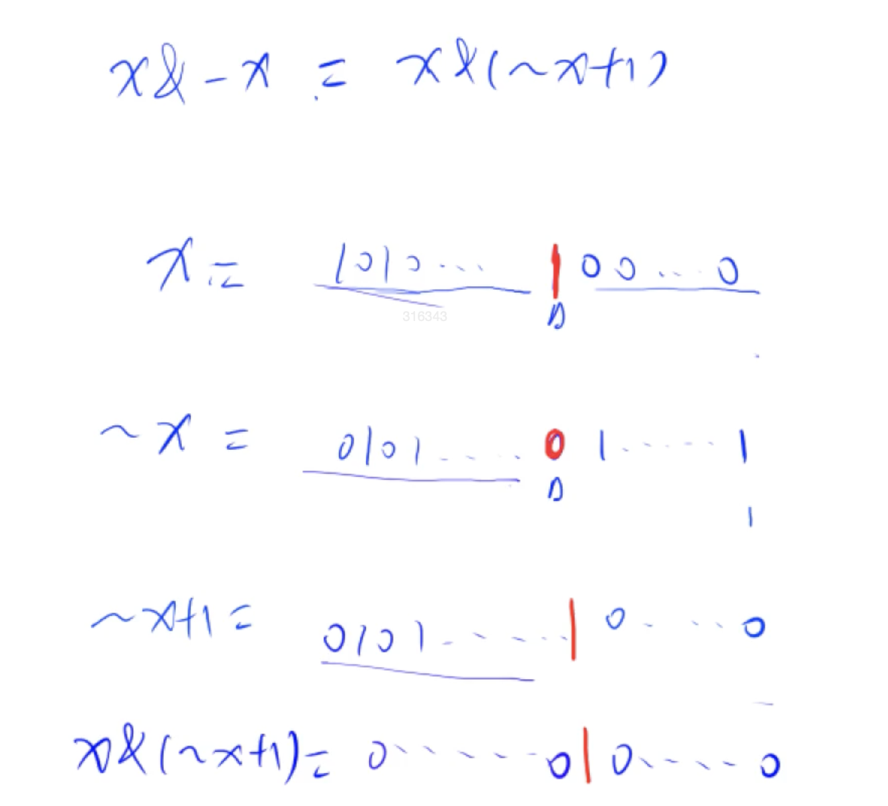
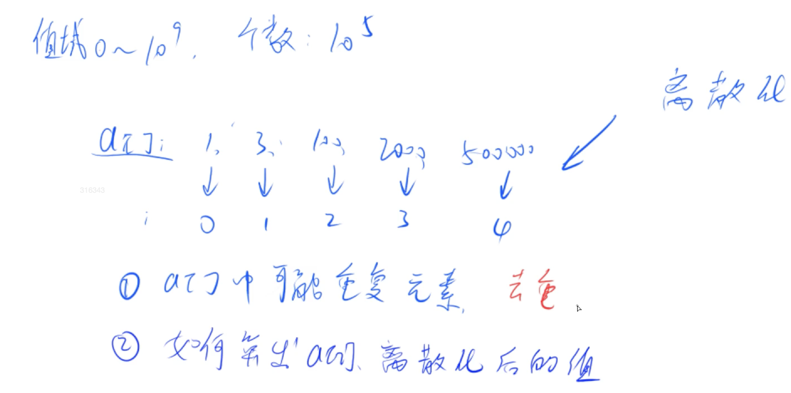
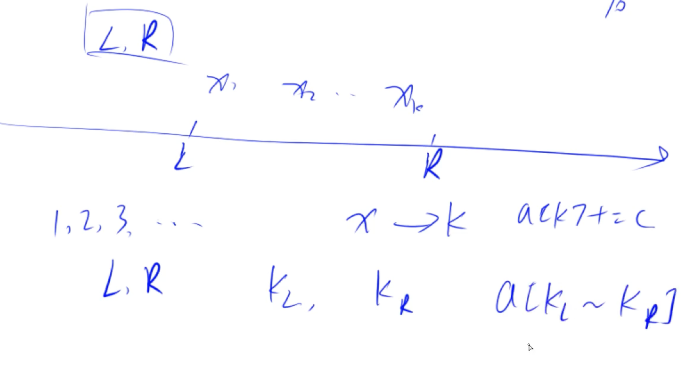

算法的模板需要**理解**背过，默写出来的模板需要可以通过调试，需要默写3-5次

# 排序

## 快速排序


调整区间是最难的部分！

时间复杂度O（nlogn）

暴力做法


比较优雅的做法就是在区间两边设立两个指针，左i右j，整个快速排序的目的是要设立一个区间分界值，保证整个数组左边是小于x的值右边是大于x的值，如果i指的值比x小就往后移动指针，如果j指的值比x大就往前移动指针。移不动的时候交换i，j的值，直到i，j移到一起。

```C++
#include<iostream>
using namespace std;

const int N = 100010;
int n;
int q[N];

void quick_sort(int q[], int l, int r) {

	if (l >= r) return;//只有一个数的话一定是有序的

	int x = q[l+r>>1], i = l - 1, j = r + 1;
    //x是分界点，i,j是两个指针，初始时刻分别指向数组的边界外
	//x=q[l+r>>1] 是位运算 ，相当于除二
	while (i < j) {
		do i++; while (q[i] < x);
		//左边都是比x小的，所以如果比x小指针就直接往中间移动
		do j--; while (q[j] > x);
		//右边都是比x大的，所以如果比x大指针就直接往中间移动
		if (i < j) swap(q[i], q[j]);
	}
	quick_sort(q, l, j);
	quick_sort(q, j + 1, r);
}

int main() {

	scanf("%d", &n);//建议使用scanf，比cin读入数据的速度更快一点
	
	for (int i = 0; i < n; i++) scanf("%d", &q[i]);//读数据

	quick_sort(q, 0, n - 1);//快排

	for (int i = 0; i < n; i++) printf("%d ", q[i]);//输出

	return 0;
}
```


## 归并排序


先把左边排好序，再把右边排好序，然后将排好序的两个合二为一。时间复杂度O（nlogn）


双指针算法：

两个指针指向分开的两个有序的数组，比较两个指针所指值的大小，小的放到最终的数组里面。直到有一个指针指到尽头，另一个数组剩余的内容直接全放进答案数组。

注意：因为归并排序是稳定的排序，所以指针相同的时候，把第一个序列的放到答案数组。

```C++
#include<iostream>
using namespace std;

const int N = 1e6 + 10;
int q[N], tmp[N];
int n;

void merge_sort(int q[], int l, int r) {
	if (l >= r) return;//如果只有一个数怎么都是有序的

	int mid = l + r >> 1;//区间中点
	merge_sort(q, l, mid);
	merge_sort(q, mid + 1, r);
	
	int k = 0, i = l, j = mid + 1;
	//k表示tmp数组中现有元素的个数，i和j是指向两个序列起点的指针
	while (i <= mid && j <= r) {
		if (q[i] <= q[j]) tmp[k++] = q[i++];
         //如果i指针的数比j的小就把i指向的数放进tmp数组
		else tmp[k++] = q[j++];
        //否则把j指向的数放进tmp数组
	}
	while (i <= mid) tmp[k++] = q[i++];//把某个序列剩余的部分直接全放进tmp数组
	while (j <= r) tmp[k++] = q[j++];

	//把临时数组的结果复制回来
	for (i = l,j = 0; i <= r; i++,j++) q[i] = tmp[j];
}

int main() {
	scanf("%d", &n);
	for (int i = 0; i < n; i++) scanf("%d", &q[i]);

	merge_sort(q, 0, n - 1);

	for (int i = 0; i < n; i++) printf("%d ", q[i]);
}
```

788逆序对数量思路：先假设merge_sort可以算出来逆序对的个数，所以分成了下面三种情况。从第三种情况下推出来公式。在合并的时候采用了双指针，如果现在q[j]<q[i],那么q[i]~mid都是大于q[j]的，数量为mid-i+1，这就是对于q[j]来说逆序对的个数


ac代码

```C++
#include<iostream>
using namespace std;

//前面一个数比后面一个数大就构成一个逆序对
typedef long long ll;//逆序对最多有n（n-1）/2所以需要long long
const int N = 1e6+10;
int q[N],tmp[N];
int n;

ll merge_sort(int l,int r){
    if(l>=r) return 0;
    //递归求逆序对
    int mid = l+r>>1;
    ll res = merge_sort(l,mid)+merge_sort(mid+1,r);
    
    //归并
    int k=0,i=l,j=mid+1;
    while(i<=mid && j<=r){
        if(q[i]<=q[j]) tmp[k++] = q[i++];
        else{
            tmp[k++] = q[j++];
            res += mid-i+1;
        }
    }
    //扫尾
    while(i<=mid) tmp[k++] = q[i++];
    while(j<=r) tmp[k++] = q[j++];
    //物归原主
    for(i=l,j=0;i<=r;i++,j++){
        q[i] = tmp[j];
    }
    
    return res;
}
int main(){
    scanf("%d",&n);
    for(int i=0;i<n;i++){
        scanf("%d",&q[i]);
    }
    cout<<merge_sort(0,n-1)<<endl;
}
```

## 二分排序

### 整数

有单调性一定可以二分，但二分不一定需要单调性。

二分排序需要根据某一种【性质】，将整个区间分成两部分，一部分满足这个性质另一部分不满足这个性质。二分可以找到区分的边界。


红色段表示满足性质的部分，绿色段表示不满足性质的部分。

1.找出红色段部分的边界（箭头指的地方）

check表示检查mid是否满足条件，如果满足，则mid在红色段（包括边界），不满足则表示在绿色段。

图中表示的是在，mid满足、不满足条件下边界所在区间以及区间的更新方式。


2.找出绿色段部分的边界                      

check表示的是检查mid是否符合绿颜色表示的性质


如果更新方式是l=mid r=mid-1则mid在计算时为（l+r+1）/2，否则不需要加一

模板：

```C++
bool check(int x){
  //检查x是否满足某种性质
}
//区间[l,r]被划分成[l,mid]和[mid+1,r]时使用：
int bsearch_1(int l,int r)
{
  while(l<r)
  {
    int mid = l+r>>1;
    if(check(mid)) r=mid;
    else l = mid+1;
  }
  return l;
}
//区间[l,r]被划分成[l,mid-1]和[mid,r]时使用：
int bsearch_2(int l,int r)
{
  while(l<r){
  int mid = l+r+1>>1;
    if(check(mid)) l = mid;
    else r = mid-1;
  }
  return l;
}
```

模板题：


```C++
#include<iostream>
using namespace std;

const int N = 1000006;
int q[N];
int n, m;

int main() {
	scanf("%d%d", &n, &m);
	for (int i = 0; i < n; i++) scanf("%d", &q[i]);

	while (m--) {
		//共有m次询问，每次询问的数设为x
		int x;
		scanf("%d", &x);
		
		int l = 0, r = n - 1;//设置区间的左右端点
		
		while (l < r) {
			int mid = l + r >> 1;//先写上l+r，然后根据后面的看需不需要加一
			if (q[mid] >= x) r = mid;
            //求左边界时划分区间的性质为>=x，此时为r=mid所以不需要加一
			else l = mid + 1;
		}
		
		if (q[l] != x) cout << "-1 -1" << endl;//序列中不存在x时返回的是第一个大于x的值
		else {
			cout << l << ' ';
            //先把左边界输出，整个循环结束的时候l和r的值是一样的，输出哪个都ok
			
			int l = 0, r = n - 1;
			//求右边界划分性质是<=x
			while (l < r) {
				int mid = l + r + 1>> 1;
				if (q[mid] <= x) l = mid;
				else r = mid - 1;
			}
			cout << l << endl;
		}

	}
	return 0;
}
```


### 浮点数

因为是浮点数，（l+r）/ 2 没有下取整的问题，算出来都是正好除以二的值，所以浮点数二分没有边界值的问题。当区间长度趋于无穷小的时候可以视作找到了区间边界。

模板：数的二次方根


```C++
#include<iostream>
using namespace std;

double Max(double x,double y){
  if(x<y) return y;
  else return x;
}
  
int main() {
	double x;
	cin << x;

	double l = 0, r = Max(1,x);
  //如果x为0.01，开根号为0.1就不在区间里面了，所以右边界起码要比1大
	while (r - l < 1e-8) {
		//比题目要求精度小两位
		double mid = (l + r) / 2;
		if (mid * mid >= x) r = mid;
		else l = mid;
	}
	printf("%lf\n", l);
	return 0;

```

模板:数的三次方根

```C++
#include<bits/stdc++.h>
using namespace std;
double Max(double x,double y){
  if(x<y) return y;
  else return x;
}
int main(){
    double x;
    scanf("%lf",&x);
    int flag = 0;
    if(x<0) {
        x = -x;
        flag = 1;
    } 
    double l=0,r=Max(1,x);
    while(r-l>1e-8){
        double mid = (l+r)/2;
        if(mid*mid*mid>=x) r = mid;
        else l=mid;
    }
    if(flag) printf("%lf",-r);
    else printf("%lf",r);
    return 0;
}
```


# 高精度

## 高精度加法

1.大整数存储，用数组进行存储，每一位存一个数字，数组下标为0的存这个整数的个位（比较容易处理进位的问题）加减乘除的高精度算法里面存储都是这么存储的

2.运算，每一位的运算包括三部分，即两个加数的这一位以及对应的进位。

```C++
#include<iostream>
#include<vector>
using namespace std;

//C = A + B
vector<int> add(vector<int> &A,vector<int> &B){//加引用更快
	vector<int> C;
	int t = 0;//存储进位
	for(int i = 0;i<A.size() || i<B.size();i++){

		if(i<A.size()) t += A[i];//如果a有这一位就加上
		if(i<B.size()) t += B[i];

		C.push_back(t%10);//存储计算结果的个位
		t /= 10;//计算进位
	}

	if(t) C.push_back(1);//最高位有没有进位
	return C;
}


int main(){
	string a,b;//因为数位太长了所以需要用字符串进行读入
	vector<int> A,B;

	cin>>a>>b;//a = "123456"
	for(int i = a.size()-1;i>=0;i--) A.push_back(a[i]-'0');
	//下标为0的数组存的是大整数的个位，存每一位的时候需要倒着遍历
	//a是一个字符串，里面存的是字符，需要-'0'转化为数字
	//A = [6,5,4,3,2,1]
	for(int i = b.size()-1;i>=0;i--) B.push_back(b[i]-'0');

	auto C = add(A,B);
	//auto表示编译器会自己推断这是一个什么类型的变量
	
	for(int i = C.size()-1;i>=0;i--) printf("%d",C[i]);

	return 0;

}
```

## 高精度减法


```C++
#include<iostream>
#include<vector>
using namespace std;


//判断是否有A>=B
bool cmp(vector<int> &A,vector<int> &B){
	//位数不同，位数越多数越大
	if(A.size() != B.size()) return A.size()>B.size();
	//位数相同，从高位比较
	for(int i = A.size()-1;i>=0;i--)
		if(A[i] != B[i])
			return A[i]>B[i];
	//都相同则两个数相等
	return true;
}

//C = A - B,A一定比B大
vector<int> sub(vector<int> &A,vector<int> &B){//加引用更快
	vector<int> C;
	for(int i = 0,t = 0;i < A.size();i++){
		t = A[i] - t;
		if(i<B.size()) t-=B[i];
		C.push_back((t+10)%10);
		if(t < 0) t = 1;//有借位
		else t = 0;	
	}

	//A有多少位C就有多少位，比如123-120=003，所以需要把C中的0去掉
	while(C.size()>1 && C.back()==0) C.pop_back();
  
	return C;
}


int main(){
	string a,b;//因为数位太长了所以需要用字符串进行读入
	vector<int> A,B;

	cin>>a>>b;//a = "123456"
	for(int i = a.size()-1;i>=0;i--) A.push_back(a[i]-'0');
	//下标为0的数组存的是大整数的个位，存每一位的时候需要倒着遍历
	//a是一个字符串，里面存的是字符，需要-'0'转化为数字
	//A = [6,5,4,3,2,1]
  
	for(int i = b.size()-1;i>=0;i--) B.push_back(b[i]-'0');

	if(cmp(A,B)){
		auto C = sub(A,B);
		for(int i = C.size()-1;i>=0;i--) printf("%d",C[i]);
	}
	else{
		auto C = sub(B,A);
		printf("-");
		for(int i = C.size()-1;i>=0;i--) printf("%d",C[i]);
	}

	return 0;
}
```


## 高精度乘法

一个比较大的数和一个比较小的数相乘，每次将比较小的数与比较大的数的每一位相乘得到一个结果t，t%10就是该位的答案，t/10就是该位的进位大小。


模板：

```C++
#include<iostream>
#include<vector>
using namespace std;

vector<int> mul(vector<int> &A,int b){
	vector<int> C;
	int t = 0;
	for(int i = 0;i<A.size()||t;i++){
		//循环条件是A还没遍历完以及遍历完后进位不为0
		if(i<A.size()) t += b * A[i];
		C.push_back(t % 10);
		t /= 10;
	}

	//A有多少位C就有多少位，比如123-120=003，所以需要把C中的0去掉
	while(C.size()>1 && C.back()==0) C.pop_back();
	
	return C;
}

int main(){
	string a;
	int b;

	cin>>a>>b;
	vector<int> A;

	for(int i = a.size()-1;i >= 0;i--)  A.push_back(a[i]-'0');

	auto C = mul(A,b);
	
	for(int i = C.size()-1;i >= 0;i--) printf("%d",C[i]);

	return 0;
}
```


## 高精度除法

一开始先把最高位看成是余数，除以b的答案就是商；再将最高位与b取模，得到这一步的余数；将这个余数乘10加上下一位，得到一个新的数，这个数除b得到下一位的商，以此类推。


模板：

```C++
#include<iostream>
#include<vector>
#include<algorithm>
using namespace std;

//C = A/b，余数为r
vector<int> div(vector<int> &A,int b,int &r){
	vector<int> C;
	r = 0;
	for(int i = A.size();i >= 0;i--){
		r = r*10 + A[i];
		C.push_back(r / b);
		r %= b; 
	}

	//C0存的是最高位，与之前加减乘的情况是逆过来的
	reverse(C.begin(),C.end());
	//去前导0
	while(C.size()>1 && C.back()==0) C.pop_back();

	return C;
}

int main(){
	string a;
	int b;

	cin>>a>>b;
	vector<int> A;

	for(int i = a.size()-1;i >= 0;i--)  A.push_back(a[i]-'0');

	int r;//余数
	auto C = div(A,b,r);
	
	for(int i = C.size()-1;i >= 0;i--) printf("%d",C[i]);
	cout<<endl;
	cout<<r<<endl;

	return 0;
}
```


---

# 前缀和

前缀和与差分是一对逆运算。**前缀和求解的数列的下标是从1开始的**

前缀和可以帮助快速的求出原数组中一段数的和


```Objective-C++
前缀和S[i] = a[1] + a[2] + ... + a[i] = S[i-1] + a[i]
```

前缀和模板or思想：

```C++
#include<iostream>
using namespace std;

const int N = 100010;

int n,m;
int a[N],s[N];

int main(){
	scanf("%d%d",&n,&m);
	for(int i = 1;i <= n;i++) scanf("%d",&a[i]);
	//前缀和下标从1开始

	for(int i = 1;i <= n;i++) s[i] = s[i-1] + a[i];

	while(m--){
		int l,r;
		scanf("%d%d",&l,&r);
		printf("%d\n",s[r] - s[l - 1]);
	}
	return 0;
}
```


**拓展到二维--求子矩阵的和**

S[i][j] 表示该点左上角所有元素的和


举例：


```C++
#include<iostream>
using namespace std;

const int N = 1010;
int a[N][N],s[N][N];
int n,m,q;

int main(){
    scanf("%d%d%d",&n,&m,&q);
    //读入矩阵
    for(int i = 1;i <= n;i++)
        for(int j = 1;j <= m;j++)
            scanf("%d",&a[i][j]);
    //求前缀和
    for(int i = 1;i <= n;i++)
        for(int j = 1;j <= m;j++)
            s[i][j] = a[i][j] + s[i-1][j] + s[i][j-1] - s[i-1][j-1];//公式
    //询问
    while(q--){
        int x1,y1,x2,y2;
        scanf("%d%d%d%d",&x1,&y1,&x2,&y2);
        printf("%d\n",s[x2][y2]-s[x1-1][y2]-s[x2][y1-1]+s[x1-1][y1-1]);
        //算子矩阵和
    }
    return 0;
}
```


# 差分

对于已知的A数组构造出一个B数组，使得A是B的前缀和，则B是A的差分

可以用于解决a数组某一段连续区间全加上或者减去某一个数的问题


先假设a数组所有值均为0，b数组所有值也均为0，看成是进行了n次插入操作

```Plain Text
先假设原数组全为0，第一次让原数组的[1,1]插入a[1],然后让原数组的[2,2]插入a[2]
以此类推，直到让原数组的[n,n]插入a[n]
此时a数组同题目给出，b差分数组直接被构造出来了
```


```C++
#include<iostream>
using namespace std;

const int N = 100010;
int a[N],b[N];//a为原数组，b为差分数组
int n,m;//n个整数，m个操作
//插入函数
void insert(int l,int r,int c){
    b[l] += c;
    b[r+1] -= c;
}
int main(){
    scanf("%d%d",&n,&m);
    for(int i = 1;i <= n; i++) scanf("%d",&a[i]);
    for(int i = 1;i <= n; i++) insert(i,i,a[i]);
    //从前往后每个数插入一遍，相当于在i到i区间内插入a[i]的值
    while(m--){
        int l,r,c;
        scanf("%d%d%d",&l,&r,&c);
        insert(l,r,c);
    }
    for(int i = 1;i <= n; i++) b[i] += b[i-1];
    //求前缀和，将b变为b的前缀和，即原数组
    for(int i = 1;i <= n; i++) printf("%d ",b[i]);
    
    return 0;
}
```

二维差分

无论是一维的差分还是二维的差分，其实在算的时候并不考虑构造的问题，只需要考虑如何通过插入对其进行更新就可以了。

给某个子矩阵全加上c


初始化：


```C++
#include<iostream>
using namespace std;

const int N = 1010;
int n,m,q;
int a[N][N],b[N][N];

void insert(int x1,int y1,int x2,int y2,int c){
    b[x1][y1] += c;
    b[x2+1][y1] -= c;
    b[x1][y2+1] -= c;
    b[x2+1][y2+1] += c;
}

int main(){
    scanf("%d%d%d",&n,&m,&q);
    //读入a数组
    for(int i = 1;i <= n;i ++)
        for(int j = 1;j <= m;j ++)
            scanf("%d",&a[i][j]);
    //插值构造出b数组
    for(int i = 1;i <= n;i ++)
        for(int j = 1;j <= m;j ++)
            insert(i,j,i,j,a[i][j]);
    while(q--){
        int x1,y1,x2,y2,c;
        cin>>x1>>y1>>x2>>y2>>c;
        insert(x1,y1,x2,y2,c);
    }
    //计算原数组,即计算前缀和
    for(int i = 1;i <= n;i ++)
        for(int j = 1;j <= m;j ++)
            b[i][j] += b[i-1][j] + b[i][j-1] - b[i-1][j-1];
    //输出结果
    for(int i = 1;i <= n;i ++){
        for(int j = 1;j <= m;j ++) printf("%d ",b[i][j]);
        puts(" ");
    }
    return 0;
}
```


# 双指针算法

分类：两个指针各指向一个序列 两个指针指向一个序列


举例：读入一个单词序列，每个单词之间有空格，需要将每个单词输出出来，并占一行

```Objective-C++
输入：
abc def ghi
输出：
abc
def
ghi
```

指针：


```C++
#include<iostream>
#include<stdio.h>
#include<string.h>
using namespace std;

int main(){
    char str[1000];
    
    gets(str);
    int n = strlen(str);
    
    for(int i = 0;i < n;i ++){
        int j = i;
        while(j < n && str[j] != ' ') j++;//双指针
        //这道题的具体逻辑
        for(int k = i;k < j;k ++) cout<<str[j];
        cout<<endl;
        i = j;
        
    }
}
```

最长连续不重复子序列

先写出朴素算法，再从朴素算法中寻找一些性质（单调性），而后使用双指针简化复杂度。

最长连续不重复子序列的两个指针具有单调性，即两个指针只会往一个方向移动，绿指针即j表示的是往左最远能走多远。若红指针后移，绿指针前移则会产生矛盾，比如由[2,3]移动成为[2,2,3,5]则产生了重复。


check表示i每次移动都要检查一下当前 [j,i] 区间内是否有重复元素，如果有就移动j，直至其中没有重复元素。

可以通过开一个数组，记录每个数出现的次数

```C++
s[N] //记录每个数出现次数的数组
s[a[i]] ++ //i向后移动
s[a[j]] -- //j向前移动
```

注意到：若在i移动之后出现了重复，则重复的一定是a[i]这个元素，因为在移动之前的[j,i]区间内没有重复的元素。

```C++
#include<iostream>
using namespace std;

const int N = 100010;

int n;
int a[N],s[N];//a为题目给出的整数序列，s用来存当前每个数出现的次数；

int main(){
    cin>>n;
    for(int i = 0;i < n;i ++) cin>>a[i];
    int res = 0; //初始化连续区间长度
    for(int i = 0,j = 0;i < n;i++){
        s[a[i]] ++;
        while(s[a[i]]>1){
            //不需要像模板中限制j的范围，因为若j比i大则区间内没有数
            //当[j,i]区间内有与当前a[i]相同的元素时j就一直右移直到不重复
            s[a[j]]--;
            j++;
        }
        res = max(res,i-j+1);
    }
    cout<<res<<endl;
    return 0;
}

```

# 位运算

作用：求二进制中1的个数


位运算举例：


输出：1010

lowbit作用：


lowbit运算：



```C++
#include<iostream>
using namespace std;

int lowbit(int x){
    return x & -x;
}
int main(){
    int n;
    cin>>n;
    while(n--){
        int x;
        cin>>x;
        int res = 0;
        while(x){
            x -= lowbit(x);//x不是0的时候，每次减去x的最后一位1
            res++;
        }
        cout<<res<<' ';
    }
    return 0;
}
```


# 整数离散化

某数组内的数值域非常大，但值的个数相对较少。因此将该数组内的元素进行映射



```C++
vector<int> alls;//存储所有离散化的值
sort(alls.begin(),alls.end());//将所有值排序
//unique会将alls数组中所有重复的元素放到最后，其余元素按序排列，数组中不重复序列的最后一个元素
//用erase将不重复序列后的全部删除，即可得到没有重复元素的数组
alls.erase(unique(alls.begin(),alls.end()),alls.end());//去掉重复元素

//二分找出x对应的离散化的值
int find(int x){
  //找到第一个大于等于x的位置
    int l = 0, r = alls.size() - 1;
    while(l < r){
        int mid = l + r >> 1;
        if(alls[mid] >= x) r = mid;
        else l = mid + 1;
    }
    return r + 1;//映射到1，2，3，...,n
}
```

例题：区间和


思路：先将x进行映射，任何对x的操作转化成对x映射后k的操作；对区间[L,R]的操作转化为映射后区间的操作。




```C++
#include<iostream>
#include<vector>
#include<algorithm>
using namespace std;

typedef pair<int,int> PII;//每次插入和查询操作都需要两个值，故用pair存

const int N = 300010;//插入需要100000，查询有两个下标，各100000

int n,m;
int a[N],s[N];//a为原数组，s为前缀和

vector<int> alls;//存所有要离散化的值
vector<PII> add,query;

int find(int x){
    //二分查找下标x在离散化之后变成什么
    int l = 0,r = alls.size()-1;
    while(l<r){
        int mid = l+r >> 1;
        if(alls[mid]>=x) r = mid;
        else l = mid+1;
    }
    return r+1;//映射到从1开始，方便求前缀和
}
int main(){
    //基本思路：所有的先读进来，对用到的下标离散化
    cin>>n>>m;
    for(int i = 0;i < n;i++){
        //读入插入操作的值，在下标为x的地方插入c
        int x,c;
        cin>>x>>c;
        add.push_back({x,c});//加入插入数组
        alls.push_back(x);//将需要操作的下标加入待离散化的数组里面去
    }
    for(int i = 0;i < m;i++){
        //读入所有的左右区间
        int l,r;
        cin>>l>>r;
        query.push_back({l,r});//加入查询数组
        alls.push_back(l);//将需要操作的下标加入待离散化的数组里面去
        alls.push_back(r);
    }
    
    sort(alls.begin(),alls.end());//排序
    alls.erase(unique(alls.begin(),alls.end()),alls.end());//去重
    
    //插入操作
    for(auto item : add){
        //item是变量名，auto可以自动识别是什么类型
        //pair有两个属性first和second
        
        int x = find(item.first);//离散化后的下标
        a[x] += item.second;//插入
    }
    //预处理前缀和
    for(int i = 1;i <= alls.size();i++) s[i] += s[i-1]+a[i];
    
    //询问操作
    for(auto item:query){
        int l = find(item.first),r = find(item.second);
        cout << s[r] - s[l-1] << endl;
    }
    
    return 0;
}
```


# 区间合并

如果区间与区间之间有交集，则合并。注意：在端点处相交也算有交集。

输入样例：

```Objective-C++
5
1 2
2 4
5 6
7 8
7 9
```

输出样例：

```Objective-C++
3
```


解题思路：


因为第一步已经按区间左端点进行排序了，所以在第二部中不会出现下一个区间的左端点比当前区间的左端点更靠左的情况了。

绿色情况：不变

黄色情况：更新右端点

粉色情况：结果加一，当前维护区间更新成粉色区间

```C++
#include<iostream>
#include<algorithm>
#include<vector>

using namespace std;

typedef pair<int,int> PII;

const int N = 100010;

int n;

vector<PII> segs;//存区间

void merge(vector<PII> &segs){
    vector<PII> res;
    
    sort(segs.begin(),segs.end());//排序，优先以左端点排序，再以右端点排序
    
    int st = -2e9,ed = -2e9;
    for(auto seg: segs){
        if(ed<seg.first){//粉色情况
            if(st != -2e9) res.push_back({st,ed});
            st = seg.first,ed = seg.second;
        }
        else ed = max(ed,seg.second);//绿色情况和黄色情况
    }
    
    if(st != -2e9) res.push_back({st,ed});
    segs = res;
}
int main(){
    cin>>n;
    for(int i = 0;i < n;i++){
        int l,r;
        cin>>l>>r;
        segs.push_back({l,r});//存区间左右端点
    }
    merge(segs);//合并
    cout<<segs.size()<<endl;
    
    return 0;
}
```

