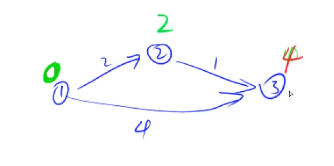
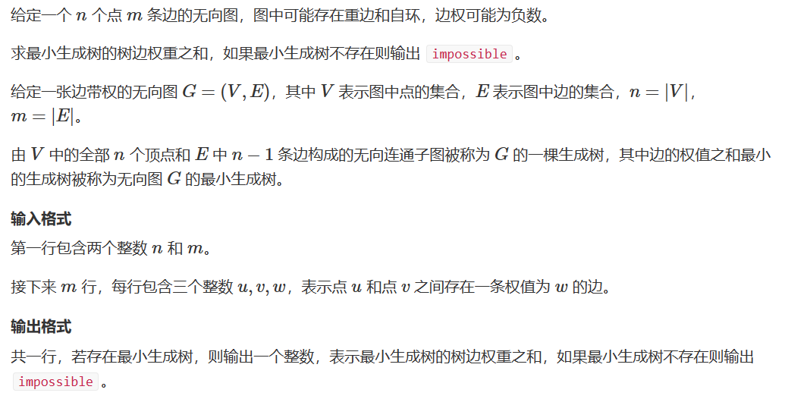

# DFS 与 BFS

## 深度优先搜索 DFS

深度搜索和宽度搜索都可以对整个空间进行搜索

深度优先：尽可能往深搜，搜到叶子节点就会回溯，边回溯边看是否还可以在这个节点继续向下深搜，直到这个点无法再继续向下深搜时才继续向上回溯。


每一个dfs都一定对应一颗搜索树


例题：全排列数字

给定一个整数 n，将数字 1∼n 排成一排，将会有很多种排列方法。

现在，请你按照字典序将所有的排列方法输出。

输入样例：

```Objective-C++
3
```

输出样例：

```Objective-C++
1 2 3
1 3 2
2 1 3
2 3 1
3 1 2
3 2 1
```

样例模拟：


注：回溯的时候要注意恢复现场，来的时候什么样，回去的时候就是什么样

```c++
#include<iostream>

using namespace std;

const int N = 10;

int n;
int path[N];
bool st[N];//每次需要填不一样的数，st记录该点是否使用过，true表示用过
void dfs(int u){
  //u = 0的时候第一层，当u走到n的时候就走到了最后一层
    if(u == n)
    {   //走到第n个位置时，输出
        for(int i = 0;i < n;i ++) printf("%d ",path[i]);
        puts("");
        return;
    }
    for(int i = 1;i <= n;i++){
        //找到一个没有被用过的数
        if(!st[i])
        {
            //枚举，并填到当前空位，记录被用过
            //状态处理好后走到下一层
            path[u] = i;
            st[i] = true;
            dfs(u + 1);
            //回溯，注意恢复现场,path[u]会自动覆盖
            st[i] = false;
        }
    }
}

int main(){
    cin >> n;
    
     dfs(0);
    
    return 0;
}
```


例题：n皇后问题

n−皇后问题是指将 n 个皇后放在 n×n 的国际象棋棋盘上，使得皇后不能相互攻击到，即任意两个皇后都不能处于同一行、同一列或同一斜线上。


现在给定整数 n，请你输出所有的满足条件的棋子摆法。

输入格式

共一行，包含整数 n。

输出格式

每个解决方案占 n 行，每行输出一个长度为 n 的字符串，用来表示完整的棋盘状态。

其中 `.` 表示某一个位置的方格状态为空，`Q` 表示某一个位置的方格上摆着皇后。

每个方案输出完成后，输出一个空行。

**注意：行末不能有多余空格。**

输出方案的顺序任意，只要不重复且没有遗漏即可。


可以按照全排列的思路来枚举，再判断是否合法

也可以边做边判断：如果产生冲突，则直接停止，放弃这条路，向上回溯（剪枝）

绿色为正对角线dg，蓝色为反对角线udg


解法一：已经知道每一行只会有一个皇后，则只需要枚举每一行，确定出来这一行的皇后应该放在哪个位置上。

```C++
#include<iostream>

using namespace std;

const int N = 20;

int n;
char g[N][N];//记录结果
bool col[N],dg[N],udg[N];//记录列，正对角线，反对角线上是否存在元素

//u表示运行到第几行，i表示现在是第几列
//将棋盘看成坐标轴，则u就表示y，i表示x
//设udg的方程为y=x+b则b=y-x，替换后b=u-i，防止出现负数，则加上n，则有b=u+n-i（其实b=n+i-u也可，目的是一个对角线能单独映射）
//设dg的方程为y=-x+b,b=y+x,替换后b=u+i
//正对角线横纵数组下标和为常数，反对角线数组下标差为常数，该常数即为对角线与坐标轴的截距
//在同一条对角线上的计算出的截距是相等的，故使用截距表示对角线
void dfs(int u)
{
    if(u == n)//走到叶子节点，则输出答案
    {
        for(int i = 0;i < n;i++) puts(g[i]);
        puts("");
        return;
    }
    for(int i = 0;i < n;i ++)
    {
        //i循环保证每一行只有一个元素
        //判断当前列，正对角线，反对角线是否都不存在元素
        if(!col[i] && !dg[u+i] && !udg[n-u+i])
        {
            g[u][i] = 'Q';
            col[i] = dg[u+i] = udg[n-u+i] = true;
            dfs(u+1);
            col[i] = dg[u+i] = udg[n-u+i] = false;//恢复现场
            g[u][i] = '.';
        }
    }
}
int main(){
    cin >> n;
    for(int i = 0;i < n;i++)
        for(int j = 0;j < n;j++)
            g[i][j] = '.';
    
    dfs(0);
    return 0;
}
```


解法2：比解法1更加原始，枚举每一个格子，放与不放分别是两个分支

每次向后一个格子，当走到每一行的最后一个的时候，直接让它越界，回到下一行第一个格子


不同的dfs题目搜索的方式可能并不完全相同，但需要在做题的时候想明白一种具体并且准确的搜索方法

```c++
#include<iostream>
using namespace std;

const int N = 20;//开二倍防止越界

int n;
bool row[N],col[N],dg[N],udg[N];

char g[N][N];

void dfs(int x,int y,int s)//x,y表示搜索的起点坐标，s表示放置皇后的个数
{
    if(y == n) y = 0,x++;//搜索到一行最后一列时，直接换到下一行第一个
    
    if(x == n)//搜索到最后一行
    {
        if(s == n)//一共放置了n个皇后,这种情况是合法的情况
        {
            for(int i= 0; i < n;i++) puts(g[i]);//puts用于输出字符串，括号里面放首字符
            puts("");
        }
        return;
    }
    //不放皇后
    dfs(x,y+1,s);
    //放皇后
    if(!row[x] && !col[y] && !dg[x+y] && !udg[x-y+n])//行列和两个对角上面都没有皇后
    {
        g[x][y] = 'Q';//放皇后
        row[x] = col[y] = dg[x+y] = udg[x-y+n] = true;//打标记
        dfs(x,y+1,s+1);//继续搜
        //恢复现场
        row[x] = col[y] = dg[x+y] = udg[x-y+n] = false;
        g[x][y] = '.';
    }
    
}

int main(){
    cin >> n;
    //初始化
    for(int i = 0;i < n;i++)
        for(int j = 0;j < n;j++)
            g[i][j] = '.';
    dfs(0,0,0);
    return 0;
}
```


## 宽度优先搜索 BFS

宽度优先：一层层地搜索，每一层全部搜完以后才会继续向下搜索。


BFS 与DFS对比：


BFS好处：一层层向外搜索，第一次搜到的点一定是最近的点，具有“最短路”性质，DFS搜索就不具有最短路的性质（图里面边的权重是相同的）

例题：走迷宫


输入样例：

```Objective-C++
5 5
0 1 0 0 0
0 1 0 1 0
0 0 0 0 0
0 1 1 1 0
0 0 0 1 0
```

输出样例：

```Objective-C++
8
```

对比起深度搜索，宽度搜索有相对固定的模板：

设立一个初始队列，当队列不空的时候拿出队头，再扩展队列


边权都是1的时候采用宽搜求最短路

```c++
#include<iostream>
#include<algorithm>
#include<cstring>

using namespace std;

typedef pair<int,int> PII;

const int N = 110;

int n,m;
int g[N][N];//存储迷宫地图
int d[N][N];//存储每一个点到起点的距离
PII q[N*N];//模拟队列

int bfs()
{
    int hh = 0,tt = 0;//队头队尾
    q[0] = {0,0};//初始化第一个点
    
    memset(d,-1,sizeof d);//将记录距离的数组初始值设为-1
    d[0][0] = 0;//初始化第一个点的距离
    
    /*
        在搜索地图的过程中，当需要从一个点继续走到下一个点的时候
        需要观察上下左右是否是可以走的，此时用向量来表示向上下左右走
        向左就是（-1，0）向上就是（0，1）向右就是（1，0），向下就是（0，-1）
    */
    int dx[4] = {-1,0,1,0},dy[4] = {0,1,0,-1};
    
    while(hh <= tt)
    {
        auto t = q[hh++];//每次取出队头元素
        
        for(int i = 0;i < 4;i++)//模拟向上下左右走
        {
            int x = t.first + dx[i],y = t.second + dy[i];
            //扩展队列
            //条件是x，y坐标都在地图范围内，当前点是可以走的，当前点没有被搜索到
            if(x >= 0 && x < n && y >= 0 && y < m && g[x][y] == 0 && d[x][y] == -1)
            {
                d[x][y] = d[t.first][t.second] + 1;//更新距离
                q[++tt] = {x,y};//放到队尾
            }
        }
    }
    //返回右下角终点到起点的距离
    return d[n-1][m-1];
}

int main()
{
    cin >> n >> m;
    
    //读入整张图
    for(int i = 0;i < n;i ++)
        for(int j = 0;j < m;j ++)
            scanf("%d",&g[i][j]);
    cout << bfs() <<endl;
    return  0;
}
```


例题：八数码问题


解题思路：


```c++
#include<iostream>
#include<cstring>
#include<algorithm>
#include<queue>
#include<unordered_map>

using namespace std;

int bfs(string start)
{
    string end = "12345678x";

    queue<string> q;
    unordered_map<string,int> d;//距离数组
    q.push(start);
    d[start] = 0;

    int dx[4] = {-1,0,1,0},dy[4] = {0,1,0,-1};

    while(q.size())
    {
        auto t = q.front();
        q.pop();

        int distance = d[t];//记录当前距离（步数）
        if(t == end) return distance;

        //状态转移
        int k = t.find('x');//找到x的下标
        int x = k/3,y = k%3;//一维数组下标转化成二维下标

        for(int i = 0;i <4;i ++)
        {
            int a = x+dx[i],b = y+dy[i];//x，y方向偏移量
            if(a >= 0 && a < 3 && b >= 0 && b < 3)//a,b都没有出界
            {
                //将（a，b）与（x，y）位置上的数互换
                swap(t[k],t[a*3+b]);//交换，需要把二维坐标转成一维的

                if(!d.count(t))//找到一个新的状态
                {
                    d[t] = distance+1;
                    q.push(t);
                }
                swap(t[k],t[a*3+b]);//状态恢复
            }
        }
    }
    return -1;//没找到就返回-1
}

int main()
{
    string start;
    for(int i = 0;i < 9;i++)
    {
        char c;
        cin >> c;
        start += c;
    }

    cout<<bfs(start)<<endl;
    return 0;
}
```

---


# 树与图的存储


树是一种无环连通图，树的存储本质就是图的存储

图分为有向图和无向图，看边是否有方向。无向图可以看成一种特殊的有向图

有向图的存储：

邻接矩阵：g[a] [b]存储从a→b的信息，不能存储重边，适合存储稠密图，较浪费空间

邻接表：本质是单链表，每个点上都有一个单链表，存这个点可以走到哪个点，存储次序并不重要


```c++
#include<cstring>
#include<iostream>
#include<algorithm>

using namespace std;

const int N = 100010,M = N*2;

int h[N],e[M],ne[M],idx;//h存链表头，e存值，ne存next指针

void add(int a,int b)
{
    //头插
    e[idx] = b,ne[idx] = h[a],h[a] = idx ++;
}

int main()
{
    memset(h,-1,sizeof h);//初始化表头指针为-1
}
```


---


# 树与图的深度优先遍历

图示：


```c++
#include<cstring>
#include<iostream>
#include<algorithm>

using namespace std;

const int N = 100010,M = N*2;

int h[N],e[M],ne[M],idx;//h存链表头，e存值，ne存next指针
bool st[N];//标记当前点是否被遍历过，每个点只遍历一次

void add(int a,int b)
{
    //头插
    e[idx] = b,ne[idx] = h[a],h[a] = idx ++;
}

void dfs(int u)
{
    st[u] = true;//标记，代表已被搜索过
    for(int i = h[u];i != -1; i = ne[i])//遍历u的所有出边
    {
        int j = e[i];//存一下当前链表中节点对应图中的编号
        if(!st[j]) dfs(j);//若当前点没被遍历过，继续深搜
    }
}

int main()
{
    memset(h,-1,sizeof h);//初始化表头指针为-1
    
    dfs(1);
}
```


例题：树的重心


输入样例

```Objective-C++
9
1 2
1 7
1 4
2 8
2 5
4 3
3 9
4 6
```

输出样例：

```Objective-C++
4
```

图示如下：


将节点1删除后，剩余三个连通块


其中，左侧连通块三个节点，中间的一个连通块有4个节点，右侧只有一个节点，所以点数的最大值为4 

将节点2删除后，剩余三个连通块


其中，最右侧的连通块点数最多为6

……

依此类推，找到题目要求的最小值

使用深度优先遍历，在遍历的过程中可以求出每一个子树中点的个数

```c++
#include<cstring>
#include<iostream>
#include<algorithm>

using namespace std;

const int N = 100010,M = N*2;

int h[N],e[M],ne[M],idx;//h存链表头，e存值，ne存next指针
bool st[N];//标记当前点是否被遍历过，每个点只遍历一次

int ans = N;
int n;

void add(int a,int b)
{
    //头插
    e[idx] = b,ne[idx] = h[a],h[a] = idx ++;
}

//返回以u为根的树中点的数量
int dfs(int u)
{
    st[u] = true;//标记，代表已被搜索过
    
    int sum = 1,res = 0;
    //sum为以u为根节点的树的点数和，当前点u算一个点数
    //res表示删掉该点后，每一个连通块大小的最大值
    
    for(int i = h[u];i != -1; i = ne[i])//遍历u的所有出边
    {
        int j = e[i];//存一下当前链表中节点对应图中的编号
        if(!st[j])//若当前点没被遍历过，继续深搜
        {
            int s = dfs(j);//当前子树的大小
            res = max(res,s);
            sum += s;//当前子树的大小也是以u为节点的树的一部分
        }
    }
    
    //除去以u为根节点的树之外的部分也是连通的，大小为n-sum
    res = max(res,n-sum);//删掉该点后最大的连通块的点数
    ans = min(ans,res);
    return sum;
}

int main()
{
    cin >> n ;
    
    memset(h,-1,sizeof h);//初始化表头指针为-1
    
    for(int i = 0;i < n-1;i ++)
    {
        int a,b;
        cin >> a >> b;
        //无向图，相当于有向图双向都可以连通
        add(a,b),add(b,a);
    }
    
    dfs(1);
    
    cout << ans << endl;
    
    return 0;
}
```


---


# 树与图的广度优先遍历

图示：


每一次扩展一层，第一次发现一个点，就是到这个点的最短路径

广度搜索的模板框架：每次取出队头t，扩展队头的所有临点，如果该临点未被遍历过，则将该临点加入队列，并更新距离


例题：图中点的层次


完全是一道裸题

宽搜框架基本同之前的框架

```C++
#include<iostream>
#include<cstring>
#include<algorithm>

using namespace std;

const int N = 100010;

int n,m;
int h[N],e[N],ne[N],idx;
int d[N],q[N];

void add(int a,int b)
{
    e[idx] = b,ne[idx] = h[a],h[a] = idx ++;
}

int bfs()
{
    int hh = 0,tt = 0;
    q[0] = 1;//初始化队头为1
    memset(d,-1,sizeof d);//初始化
    d[1] = 0;//初始化1为起点
    while(hh <= tt)
    {
        int t = q[hh++];
        
        for(int i = h[t];i != -1;i = ne[i])
        {
            int j = e[i];//当前链表中节点对应图中的编号
            if(d[j] == -1)//没被遍历过
            {
                d[j] = d[t] + 1;
                q[++tt] = j;
            }
        }
    }
    return d[n];
    
}

int main()
{
    cin >> n >> m;
    memset(h,-1,sizeof h);
    for(int i = 0;i < m;i ++)
    {
        int a,b;
        cin >> a >> b;
        add(a,b);
    }
    cout << bfs() << endl;
    
    return 0;
}
```


---


# 拓扑排序

图的拓扑序列是图的宽度搜索应用，并且一定针对有向图，无向图没有拓扑序列。

例题：


并不是所有图都有拓扑序，如环。但有向无环图一定有拓扑序列，它也被称为拓扑图

拓扑序列简单来说就是按照图中各点的编号，所有的边都是从前指向后的

思路：

将所有入度为0的点加入队列，当一个点入度为0代表不再有点指向当前这个点。每次弹出队头元素并遍历该元素的所有出边。出边指向的元素一定比当前元素更加靠后，删掉该边后将被指向元素的入度减一（d表示入度），若被指元素的入度变为0，则将其加入队列中


如果存在环，则环上所有点不可能全部入队。反之，如果图是一个有向无环图，则一定至少存在一个入度为0的点，所有点一定能全部入队


```c++
#include<iostream>
#include<cstring>
#include<algorithm>

using namespace std;

const int N = 100010;

int n,m;
int h[N],e[N],ne[N],idx;
int q[N],d[N];

void add(int a,int b)
{
    e[idx] = b,ne[idx] = h[a],h[a] = idx ++;
}

bool topsort()
{
    int hh = 0,tt = -1;
    
    for(int i = 1;i <= n;i++)//注意是从1开始
    {
        if(!d[i])
            q[++tt] = i;//遍历图，如果入度为0，则加入队列
    }
    
    while(hh <= tt)
    {
        int t = q[hh++];//取队头
        for(int i = h[t];i != -1;i = ne[i])
        {
            int j = e[i];
            d[j]--;
            if(d[j] == 0) q[++tt] = j;
        }
    }
    
    return tt == n - 1;//最后看是否所有元素都加入过队列，若都加入过则表明有拓扑排序
    
}

int main(){
    cin >> n >> m;
    
    memset(h,-1,sizeof h);
    
    for(int i = 0;i < m;i ++ )
    {
        int a,b;
        cin >> a >> b;
        add(a,b);
        d[b] ++;//插入一条由a指向b的边，则b的入度加一
    }
    if(topsort())//存在拓扑序,q中次序恰好为拓扑序
    {
        for(int i = 0;i < n;i ++) printf("%d ",q[i]);
        puts("");
    }
    else puts("-1");//不存在拓扑序
   
    return 0;
}
```


---


# 最短路


分为单源最短路和多源汇最短路

单源最短路：求从一个点到其他所有点的最短路(只有一个起点)

- 所有边权都为正值：

    朴素迪杰斯特拉算法O（n^2）适用于稠密图

    堆优化迪杰斯特拉算法O（mlogn）稀疏图

- 存在负权边

    Bellman-Ford算法 O（nm）

    SPFA 一般情况下O（m），最坏O（nm）

多源汇最短路：源点即为起点，汇点即为重点，起点终点都不确定，求最短路（可能有多个起点）

- Floyd算法 O(n^3)

注：n表示点的数量，m表示边的数量，在最短路中有向图和无向图都可以当作有向图来处理（无向图是一种特殊的有向图）

重点：建图，如何将原问题抽象成一个最短路问题，如何定义点和边


## 朴素dijkstra

框架：


先初始化距离，一开始只有1号点的距离是确定的，置为0，其余点距离置为正无穷。迭代，每次确定一个点到起点的最短路，当前还未确定的点当中距离最小的一个点，一定是最短路。确定这个点后，更新其余点的最短路距离。


举例：

step1：初始化


step2：找到最小值0，确定这个点的最短路（标为绿色）。更新其他点到起点的距离。也就是根据1更新2和3到1（起点）的距离

第一次迭代：

最小值：


更新：


第二次迭代：

再找最小值：



根据2更新：


第三次迭代：只剩3一个点，故最短路就是3


朴素迪杰斯特拉适用于稠密图，稠密图应该用邻接矩阵存储

如果是稀疏图则采用邻接表存储

```c++
#include<iostream>
#include<cstring>
#include<algorithm>

using namespace std;

const int N = 510;

int n,m;
int g[N][N];
int dist[N];//当前最短距离
bool st[N];//标记最短路是否已经确定了

/*
    本题存在重边和自环，显然自环不会出现在最短路之中
    重边记录最短的一条即可
*/

int dijkstra()
{
    //初始化
    memset(dist,0x3f,sizeof dist);
    dist[1] = 0;
    //迭代
    for(int i = 0;i < n;i ++)
    {
        int t = -1;
        for(int j = 1;j <= n;j ++)
        {
            //从没确定的点中找一个最小的
            if(!st[j] && (t == -1 || dist[t] > dist[j]))
                t = j;
        }
        
        st[t] = true;//t加入集合
        
        //更新其他点的距离1->t->j更新1->j
        for(int j = 1;j <= n;j++)
            dist[j] = min(dist[j],dist[t] + g[t][j]);
        
    }
    if(dist[n] == 0x3f3f3f3f) return -1;
    return dist[n];
}

int main()
{
    scanf("%d%d",&n,&m);
    //初始化
    memset(g,0x3f,sizeof g);
    
    while(m--)
    {
        int a,b,c;
        scanf("%d%d%d",&a,&b,&c);
        g[a][b] = min(g[a][b],c);//可能存在重边，取最小值
    }
    
    int t = dijkstra();
    
    printf("%d\n",t);
    
    return 0;
}
```


## 堆优化版dijkstra

题目背景：

给定一个 n 个点 m 条边的有向图，图中可能存在重边和自环，所有边权均为非负值。

请你求出 1 号点到 n 号点的最短距离，如果无法从 1 号点走到 n 号点，则输出 −1。

输入格式：

第一行包含整数 n 和 m。

接下来 m 行每行包含三个整数 x,y,z，表示存在一条从点 x 到点 y 的有向边，边长为 z。

输出格式：

输出一个整数，表示 1 号点到 n 号点的最短距离。

如果路径不存在，则输出 −1。


堆优化版本的Dijkstra是不需要手写堆来实现的，直接用优先队列即可。比起朴素版的Dijkstra，堆优化版的简单来说就是用堆这种结构对朴素版的进行优化。


适用于稀疏图的情况，对应地，图的存储也应该变为临接表的形式


模板代码：

```c++
#include <cstring>
#include <iostream>
#include <algorithm>
#include <queue>

using namespace std;

typedef pair<int, int> PII;//用堆维护所有点的距离，需要知道节点的编号

const int N = 1e6 + 10;

int n, m;
int h[N], w[N], e[N], ne[N], idx;//临接表，w表示权重
int dist[N];
bool st[N];

//存图中的边
void add(int a,int b,int c)
{
    e[idx] = b,w[idx] = c,ne[idx] = h[a],h[a] = idx++;
}

int dijkstra()
{
    memset(dist,0x3f,sizeof dist);
    dist[1] = 0;
    priority_queue<PII,vector<PII>,greater<PII>> heap;//小根堆
    heap.push({0 , 1});//初始化1号点，更新其余所有点，距离为0，编号为1
    //迭代，堆不空
    while(heap.size())
    {
        auto t = heap.top();//每次找到距离最近的点
        heap.pop();
        
        int ver = t.second,distance = t.first;//ver表示点的编号，distance表示距离
        
        if(st[ver]) continue;//st[ver]为真表示该点之前已经出现过了，表示当前为冗余备份
        st[ver] = true;
        
        //更新其余所有点
        //遍历从t出去的所有边
        for(int i = h[ver];i != -1;i = ne[i])
        {
            int j = e[i];//编号
            if(dist[j] > dist[ver] + w[i])
            {
                //当前距离大于从t过来的距离，需要更新
                dist[j] = dist[ver] + w[i];
                heap.push({dist[j],j});//j放入优先队列中
            }
        }
    }
    if(dist[n] == 0x3f3f3f3f) return -1;
    return dist[n];
}

int main()
{
    scanf("%d%d", &n, &m);

    memset(h, -1, sizeof h);
    while (m -- )
    {
        int a, b, c;
        scanf("%d%d%d", &a, &b, &c);
        add(a, b, c);
    }

    printf("%d\n", dijkstra());

    return 0;
}
```


## Bellman-Ford算法

用途：处理有负权边的图

基本思路：迭代n次，每一次循环所有边a,b,w(从a→b，权重为w)。在遍历的过程中更新，如果1→a→b更短，用1→a→b更新1→b


循环后，所有边都满足：dist[b] ≤ dist[a] + w;(三角不等式)，更新的过程称为松弛操作。

注意：如果有负权回路，最短路不一定存在，如下图，每走一次回路距离都会-1


迭代次数的意义：迭代k次后的dist数组表示从1号点，经过不超过k条边，走到每一个点的最短距离；迭代n次时仍有修改，则表示存在一条最短路径，这条路径上有n条边，说明存在负环；因为有n条边意味着需要n+1个点，但图中点的个数为n，说明此时一定存在负权环


每次新的迭代前，需要对dist数组备份，避免出现串联的情况，若k = 1，表示只能迭代一次，故从1号点到3号点只能走下面长度为3的边而不能先到2再转到3


串联：由于这个算法的特性决定，每次更新得到的必然是在多考虑 1 条边之后能得到的全局的最短路。而串联指的是一次更新之后考虑了不止一条边：由于使用了松弛，某节点的当前最短路依赖于其所有入度的节点的最短路；假如在代码中使用dist[e.b]=min(dist[e.b],dist[e.a] + e.c);，我们无法保证dist[e.a]是否也在本次循环中被更新，如果被更新了，并且dist[e.b] > dist[e.a] + e.c，那么会造成当前节点在事实上“既考虑了一条从某个节点指向a的边，也考虑了a->b”，共两条边。而使用dist[e.b]=min(dist[e.b],backup[e.a] + e.c);，可以保证a在dist更新后不影响对b的判定，因为后者使用backup数组，保存着上一次循环中的dist的值。


例题：

给定一个 n 个点 m 条边的有向图，图中可能存在重边和自环， **边权可能为负数**。

请你求出从 1 号点到 n 号点的最多经过 k 条边的最短距离，如果无法从 1 号点走到 n 号点，输出 `impossible`

注意：图中可能 **存在负权回路** 。

输入格式：

第一行包含三个整数 n,m,k。

接下来 m 行，每行包含三个整数 x,y,z，表示存在一条从点 x 到点 y 的有向边，边长为 z。

点的编号为 1∼n。

输出格式：

输出一个整数，表示从 1 号点到 n 号点的最多经过 k 条边的最短距离。

如果不存在满足条件的路径，则输出 `impossible`。

模板：

```c++
#include<iostream>
#include<cstring>
#include<algorithm>

using namespace std;

const int N = 510,M = 10010;

int n,m,k;
int dist[N],backup[N];//dist存距离，backup存上一次迭代的结果

//结构体存所有边
struct Edge
{
    int a,b,w;//从a到b权重为w的边
}edges[M];

void bellman_ford()
{
    //初始化
    memset(dist, 0x3f, sizeof dist);
    dist[1] = 0;
    
    //边数不能超过k，故迭代次数为k
    for(int i = 0;i < k; i++)
    {
        memcpy(backup,dist,sizeof dist);
        for(int j = 0; j < m;j ++)
        {
            int a = edges[j].a , b = edges[j].b , w = edges[j].w;
            dist[b] = min(dist[b],backup[a] + w);
        }
    }
}


int main()
{
    scanf("%d%d%d",&n,&m,&k);
    
    //存所有边
    for(int i = 0;i < m;i ++)
    {
        int a,b,w;
        scanf("%d%d%d",&a,&b,&w);
        edges[i] = {a,b,w};
    }
    
    bellman_ford();
    
    if (dist[n] > 0x3f3f3f3f / 2) puts("impossible");
  //负权边可能导致距离略小于0x3f3f3f3f 
    
    else printf("%d\n", dist[n]);
    
    return 0;
}
```


## spfa算法

观察式子：dist[b] = min(dist[b],backup[a] + w)  仅当原来的dist[a]变小之后dist[b]才会变小，spfa使用宽搜对bellman_ford算法优化


初始化将第一个点加入队列，所有在队列中的点意味着该点的dist与原来比变小了。当队列不空的时候，取出队头t，由于t点的dist变小了，则更新t点的所有出边的dist，将出边对应的点加入队列（如果该点之前已经被加入过队列则没有必要重复加入）

简单来说就是更新过谁，就用谁更新别人

模板代码：

```c++
#include<iostream>
#include<cstring>
#include<queue>
#include<algorithm>

using namespace std;

const int N = 100010;

int n,m;
int h[N],w[N],e[N],ne[N],idx;
int dist[N];
bool st[N];

void add(int a,int b,int c)
{
    e[idx] = b,w[idx] = c,ne[idx] = h[a],h[a] = idx++;
    
}

int spfa()
{
    //初始化
    memset(dist,0x3f,sizeof dist);
    dist[1] = 0;
    
    queue<int> q;
    q.push(1);
    st[1] = true;//标记该点被放入队列
    
    while(q.size())
    {
        int t = q.front();
        q.pop();
        
        st[t] = false;
        
        //更新队头元素所有出边
        for(int i = h[t];i != -1;i = ne[i])
        {
            int j = e[i];
            if(dist[j] > dist[t] + w[i])
            {
                dist[j] = dist[t] + w[i];
                if(!st[j])//该点之前并不在队列里面，则加入队列
                {
                    q.push(j);
                    st[j] = true;
                }
            }
        }
    }
    return dist[n];
}

int main()
{
    scanf("%d%d",&n,&m);
    
    memset(h,-1,sizeof h);
    
    while(m--)
    {
        int a,b,c;
        scanf("%d%d%d",&a,&b,&c);
        add(a,b,c);
    }
    int t = spfa();
    
    if(t == 0x3f3f3f3f) puts("impossible");
    else printf("%d\n",t);
    
    return 0;
}
```


spfa算法判断负环：


dist数组记录最短距离，cnt数组记录最短距离情况下的边数。当起点经过t到达x比起点到达x的距离短时，更新dist的数组和cnt数组。当cnt[x] ≥ n时说明，到达x的边数比n还多，这就意味着路途中经过了负环


判断负环的模板代码是在spfa模板的基础上做出了一些更改

```c++
#include<iostream>
#include<cstring>
#include<queue>
#include<algorithm>

using namespace std;

const int N = 100010;

int n,m;
int h[N],w[N],e[N],ne[N],idx;
int dist[N],cnt[N];
bool st[N];

void add(int a,int b,int c)
{
    e[idx] = b,w[idx] = c,ne[idx] = h[a],h[a] = idx++;
    
}

bool spfa()
{
    /*
    判断是否有负环不需要初始化，反正不是求最短边
    //初始化
    memset(dist,0x3f,sizeof dist);
    dist[1] = 0;
    */
    queue<int> q;
    for(int i = 1;i <= n; i++)
    {
        st[i] = true;
        q.push(i);
    }
    /*
    有可能有些负环存在，但是从1开始并不能达到这一个负环
    因此一开始将1加入队列的操作并不合理
    将所有点全放进去，则只要存在负环就能找到
    queue<int> q;
    q.push(1);
    st[1] = true;//标记该点被放入队列
    */
    while(q.size())
    {
        int t = q.front();
        q.pop();
        
        st[t] = false;
        
        //更新队头元素所有出边
        for(int i = h[t];i != -1;i = ne[i])
        {
            int j = e[i];
            if(dist[j] > dist[t] + w[i])
            {
                dist[j] = dist[t] + w[i];
                cnt[j] = cnt[t] + 1;//更新边数
                
                if(cnt[j] >= n) return true;//存在负环
                if(!st[j])//该点之前并不在队列里面，则加入队列
                {
                    q.push(j);
                    st[j] = true;
                }
            }
        }
    }
    return false;//如果前面没有返回true，在这返回false
}

int main()
{
    scanf("%d%d",&n,&m);
    
    memset(h,-1,sizeof h);
    
    while(m--)
    {
        int a,b,c;
        scanf("%d%d%d",&a,&b,&c);
        add(a,b,c);
    }
    int t = spfa();
    
    if(spfa()) puts("Yes");
    else puts("No");
    
    return 0;
}
```


## Floyd最短路

作用：求解多源汇最短路，可以处理负权边，但是不能有负环


d存储图里面每条边（邻接矩阵），三重循环，每次更新一遍，循环后d[i,j]表示 i 到 j 的最短距离

```c++
#include<iostream>
#include<cstring>
#include<algorithm>

using namespace std;

const int N = 210,INF = 1e9;

int n,m,Q;
int d[N][N];

void floyd()
{
    for(int k = 1;k <= n;k ++)
        for(int i = 1;i <= n;i ++)
            for(int j = 1;j <= n;j ++)
                d[i][j] = min(d[i][j],d[i][k] + d[k][j]);
}
int main(){
    scanf("%d%d%d",&n,&m,&Q);
    
    //初始化，d[i][i] = 0,其余初始化为正无穷
    for(int i = 1;i <= n;i ++)
        for(int j = 1;j <= n;j ++)
            if(i == j) d[i][j] = 0;
            else d[i][j] = INF;
    //存图
    while(m--)
    {
        int a,b,w;
        scanf("%d%d%d",&a,&b,&w);
        d[a][b] = min(d[a][b],w);//若有重边，存一条最短的
        
    }
    floyd();
    
    //处理所有询问
    while(Q--)
    {
        int a,b;
        scanf("%d%d",&a,&b);
        if(d[a][b] > INF/2) puts("impossible");
        else printf("%d\n",d[a][b]);
    }
    return 0;
}
```


# 最小生成树

## prim算法

### 朴素版prim算法

时间复杂度: O(n^2)

适用于稠密图

算法框架：


先将所有点的dist初始化为正无穷，遍历所有的点，找到集合外距离最近的点t，用t更新其他点到集合的距离，将t加入集合。由于是求到一个集合的距离，实际上出现负权边也无所谓

注意这里与dijkstra算法的不同点在于dijkstra每次找的是距离起点最近的点，而prim算法每次找的是距离集合最近的点，集合表示当前已经在连通块当中的所有点

例题：



朴素版prim模板：

```c++
#include<iostream>
#include<cstring>
#include<algorithm>

using namespace std;

const int N = 510,INF = 0x3f3f3f3f;

int n,m;
int g[N][N];//邻接矩阵存图
int dist[N];//到集合的距离
bool st[N];//标志是否已经放到连通块的集合中

int prim()
{
    memset(dist,0x3f,sizeof dist);//初始化
    
    int res = 0;//连通块中各边距离和
    
    //迭代n次，每次选一个点加入连通块
    for(int i = 0; i < n;i ++)
    {
        int t = -1;//初始值，当前还没找到
        /*  
            遍历，找到离集合最近的点
            最近的点的需要不在连通块内
            如果t = -1表示刚开始还没找到
            如果当前点比t更小，则更新t
        */
        for(int j = 1;j <= n;j ++)
            if(!st[j] && (t == -1 || dist[t] > dist[j]))
                t = j;  
        
        if(i && dist[t] == INF) return INF;//不是第一个点并且不连通则返回
        
        if(i) res += dist[t];//除第一个点外都要加上当前点到集合的距离
        st[t] = true;//迭代后找到合法的t加入连通块
        
        //用t更新集合外所有点到集合的距离，如果集合外到原集合的距离大于到t的距离就更新
        //一定要先计算res再更新，以防负自环将自己到集合的距离更新的更小
        for(int j = 1; j <= n;j ++) dist[j] = min(dist[j],g[t][j]);
        
    }
    return res;
}


int main()
{
    scanf("%d%d",&n,&m);
    
    memset(g,0x3f,sizeof g);//初始化
    
    while(m--)
    {
        int a,b,c;
        scanf("%d%d%d",&a,&b,&c);
        //无向图相当于有向图两点之间是双向边
        //重边取最小
        g[a][b] = g[b][a] = min(g[a][b],c);
    }
    
    int t = prim();
    
    if(t == INF) puts("impossible");
    else printf("%d\n",t);
    
    return 0;
}
```


### 堆优化版prim算法

时间复杂度: O(mlogn)

实际上并不太常用

## kruskal算法

时间复杂度：O(mlogm)

适用于稀疏图

算法框架：


a，b连通的问题由之前数据结构章节的并查集来解决

kruskal不需要存图，只需要把每条边存储下来即可

```c++
#include<iostream>
#include<cstring>
#include<algorithm>

using namespace std;

const int N = 100010,M = 200010,INF = 0x3f3f3f3f;

int n,m;
int p[N];//并查集祖宗节点

//用结构体存每一条边
struct Edge
{
    int a,b,w;//边ab的权值为w
    
    //重载运算符，按照边权排序
    bool operator< (const Edge &W)const
    {
        return w <W.w;
    }
}edges[M];

//找祖宗节点
int find(int x)
{
    if(p[x] != x) p[x] = find(p[x]);
    return p[x];
}

int kruskal()
{
    sort(edges,edges+m);//按边权升序排序
    
    for(int i = 1; i <= n;i ++) p[i] = i;//初始化并查集
    int res = 0,cnt = 0;//res表示树的所有边权和，cnt记录边的个数
    for(int i = 0;i < m;i ++)
    {
        int a = edges[i].a,b = edges[i].b,w = edges[i].w;
        
        a = find(a),b = find(b);
        if(a != b)
        {
            //a,b所在的两个集合并不连通,则合并
            p[a] = b;
            res += w;
            cnt++;
        }
    }
    if(cnt < n-1) return INF;//边数少于n-1表示并不连通，不存在最小生成树
    return res;
}

int main()
{
    scanf("%d%d",&n,&m);
    
    for(int i = 0;i < m;i ++)
    {
        int a,b,w;
        scanf("%d%d%d",&a,&b,&w);
        edges[i] = {a,b,w};
    }
    
    int t = kruskal();
    
    if(t == INF) puts("impossible");
    else printf("%d\n",t);
    
    return 0;
}
```


# 二分图

## 染色法

用途：判别一个图是不是二分图

时间复杂度：O(m+n)

性质：一个图是二分图，当且仅当图中不含奇数环（环中边数为奇数）

可以把整个集合分为两边，每边的集合内部没有边，所有的边都是集合与集合之间的边。

染色：遍历所有点，先设第一个点属于左边，则所有与第一个点直接相邻的点都属于右边，再继续进行遍历，不断染色，策略就是当前节点直接相邻的点与当前节点不属于同一个集合。由于图中不含奇数环，故染色过程中一定不会出现矛盾，所有点一定可以完成染色。


例题：


判断依据：当该图为二分图时，染色过程中不会出现矛盾，否则出现矛盾

代码框架：借助深度优先实现染色


染色法判断二分图模板代码

```c++
#include<iostream>
#include<algorithm>
#include<cstring>

using namespace std;

const int N = 100010,M = 200010;//因为是无向图，存边要存两次

int n,m;
int h[N],e[M],ne[M],idx;
int color[N];//存颜色，1，2表示两种颜色 

//存图
void add(int a,int b)
{
    e[idx] = b,ne[idx] = h[a],h[a] = idx++;
}

//u表示当前节点，c表示颜色
bool dfs(int u,int c)
{
    color[u] = c;//u节点的颜色为c
    
    //遍历节点u所有相邻节点
    for(int i = h[u];i != -1; i = ne[i])
    {
        int j = e[i];
        if(!color[j])
        {
            //并未染色,则对其染色，染成另外一种颜色
            //3-c表示若u的颜色为1则染为2，反之染为1
            //染色不成功返回false
            if(!dfs(j,3-c)) return false;
        }
        else if(color[j] == c) return false;//u的邻点与u颜色相同，矛盾
    }
    
    return true;
}

int main()
{
    scanf("%d%d",&n,&m);
    
    memset(h,-1,sizeof h);
    //读入每条边
    while(m--)
    {
        int a,b;
        scanf("%d%d",&a,&b);
        add(a,b),add(b,a);//无向边
    }
    bool flag = true;//染色是否冲突
    for(int i = 1;i <= n;i ++)
    {
        if(!color[i])//当前点没有染色
        {
            if(!dfs(i,1))//第一个点染成1，如果染色不成功也就是dfs返回了false则记录冲突
            {
                flag = false;
                break;
            }
        }
    }
    if(flag) puts("Yes");
    else puts("No");
    
    return 0;
}
```


## 匈牙利算法

求二分图的最大匹配

时间复杂度：O(mn)，实际上远小于该值

基本思路：可以在较短时间内，求出左右匹配成功的最大数量。（不存在两条边共用一个节点称为一个成功匹配）

每次节点x要和节点y匹配时会出现两种情况：

- 还没有节点和y匹配，则x和y可以顺利匹配

- y节点已经在x节点前与z节点匹配成功，这时观察z节点是否能和除了x之外的节点匹配，如果能则可以让出x节点使x节点可以与y节点匹配。


例题：二分图的最大匹配


注意：虽然整个图是无向图，但是只用存储一个方向的边，因为搜索的过程只发生在查找左边每个节点指向了哪些右边的节点（如上上个图）


现在来形象一点理解这个题：把男生看成是左边的点，女生看成是右边的点，遍历所有男生
让该男生考虑所有心动女生，如果当前女生单身，该女生就接受该男生，或者该女生的对象找了备胎，则让对象和备胎在一起，女生和男生在一起。

结合代码：

n1 个男生；到第i个男生的时候，我们每到一个男生的时候，都会以这个男生为最优先考虑的对象；我们为他假设妹子都没被选（memset（st, false, …））；然后去看这个男生有没有可以勾搭的妹子（find(i)）函数的作用， for() 循环就是看有没有可以下手的妹子；如果没有妹子可以撩，return false； 接下来看 for 循环具体的内容： 对于第 i 个男生；肯定是可以选到妹子的（除非他本来一个备胎都没有）；他选到妹子，有两种情况：一个是妹子没有被前面的男生选（macth[ j ] == 0）; 还有一个就是 妹子被前面男生选过了；那么，我们得在假设 j 号 女生给了 i 号男生的条件下；去看看有冲突的那个男生能不能找到新的妹子； 这个冲突男找新妹子就是循环了。 总结： find( i ) 的功能就是看看 i 号男 能不能找到妹子； 找到的话 match[j] = i 返回true； 找不到， 返回false；


```c++
#include<iostream>
#include<cstring>
#include<algorithm>

using namespace std;

const int N = 510,M = 100010;

int n1,n2,m;
int h[N],e[M],ne[M],idx;//邻接表
int match[N];//用于记录匹配的结果
bool st[N];//query男生是否询问过女生，保证每个女生只询问一遍

void add(int a,int b)
{
    e[idx] = b,ne[idx] = h[a],h[a] = idx++;
}

bool find(int x)
{
    //遍历男生所有的【备胎】
    for(int i = h[x];i != -1; i = ne[i])
    {
        int j = e[i];//备胎的编号
        if(!st[j])//还没询问过当前备胎
        {
            st[j] = true;//表示当前备胎已经被询问过了，不会再询问一次了
            if(match[j] == 0 || find(match[j]))
            {
                //当前备胎还没有对象，或当前备胎的对象可以找他的另一个备胎
                //递归产生的find栈不会再去询问match[j]自己的对象j
                match[j] = x;//匹配双方
                return true;//匹配成功
            }
        }
    }
    return false;
}

int main()
{
    scanf("%d%d%d",&n1,&n2,&m);
    
    memset(h,-1,sizeof h);
    
    while(m--)
    {
        int a,b;
        scanf("%d%d",&a,&b);
        add(a,b);
    }
    int res = 0;//当前匹配的数量
    for(int i = 1;i <= n1;i ++)
    {
        // 每个男生最初都没有询问过女生,且保证每个女生只被询问一次
        memset(st,false,sizeof st);
        
        if(find(i)) res ++;
    }
    
    printf("%d\n",res);
    
    return 0;
}
```


