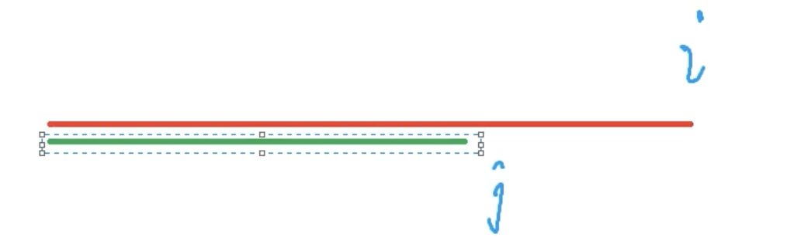
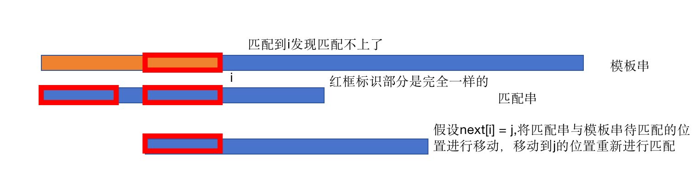
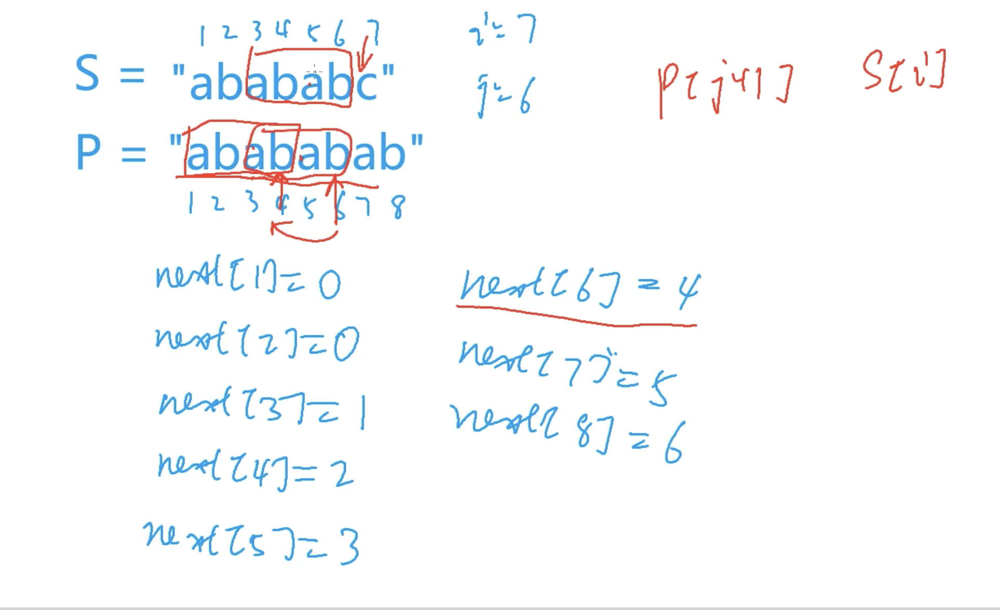
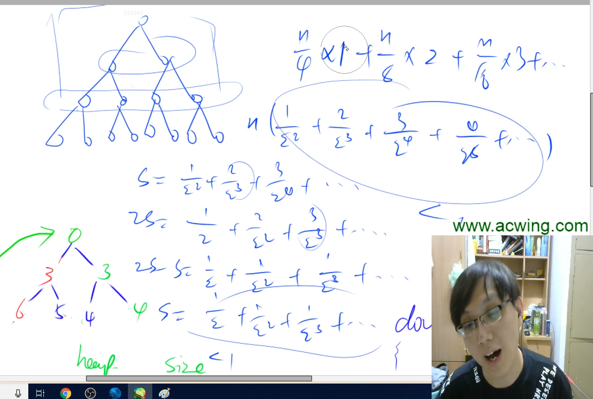
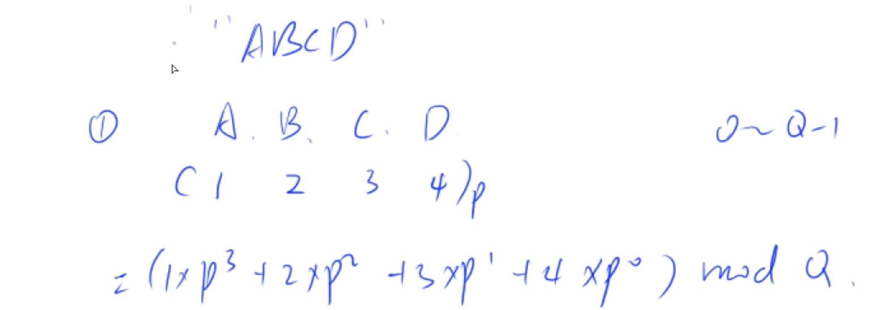

# 链表

---

## 单链表

用的最多的是邻接表：存图和存数


```Objective-C++
e[N]表示值
ne[N]表示next指针
```


翻译一下就是：

1.向链表头部插入一个数

2.删除下标为k-1后面的结点

3.将x插入到下标为k-1的结点的后面

注意：第k个插入的点下标是k-1

```c++
#include<iostream>
using namespace std;

const int N = 100010;

// head 表示头结点的下标
// e[i] 表示节点i的值
// ne[i] 表示节点i的next指针是多少
// idx 存储当前已经用到了哪个点

int head, e[N], ne[N], idx;

//初始化
void init(){
    head = -1;
    idx = 0;
}

// 将x插到头结点
void add_to_head(int x){
    e[idx] = x, ne[idx] = head,head = idx,idx ++;
}

// 将x插到下标是k的点后面
void add(int k,int x){
    e[idx] = x, ne[idx] = ne[k], ne[k] = idx,idx ++;
}

//将下标是k的点后面的点删掉
void remove(int k){
    ne[k] = ne[ne[k]];
}

int main(){
    int m;
    cin>>m;
    
    init();
    
    while(m--){
        int k,x;
        char op;
        
        cin>>op;
        if(op == 'H'){
            cin >> x;
            add_to_head(x);
        }
        else if(op == 'D'){
            cin >> k;
            if(!k) head = ne[head];
            else remove(k-1);
        }
        else{
            cin>>k>>x;
            add(k-1,x);
        }
    }
    for(int i = head; i != -1;i = ne[i]) cout << e[i] <<' ';
    cout<<endl;
    return 0;
}
```

## 双链表

用来优化某些问题


初始化：假设0表示左端点，1表示右端点

假设：l表示左边相邻结点，r表示右边相邻结点

在k的右边插入：先把这个结点连上


修改插入位置前后结点的指针：一定要先修改k右侧结点的左指针，否则会出现找不到k原来右侧的结点，导致无法进行相应的修改。


在k的左边插入x：等价于在k的左边结点 的右边 插入一个x，转化成上面的形式


删除第k个结点：将左右两边的结点连起来就可以了。让左边结点的右指针指向k右边，k右边结点的左边指向k左边。


```c++
#include<iostream>
using namespace std;

const int N = 100010;

int m;

int e[N],l[N],r[N],idx;

//初始化
//0是左端点，1是右端点
void init(){
    r[0] = 1;
    l[1] = 0;
    idx = 2;
}
//在k的右边插入一个x
void add(int k,int x){
    e[idx] = x;
    r[idx] = r[k];
    l[idx] = k;
    l[r[k]] = idx;//这步一定要先于后面那步
    r[k] = idx;
    idx++;//插入后一定要移idx；
}
//删除第k个点
void remove(int k){
    r[l[k]] = r[k];
    l[r[k]] = l[k];
}

int main(){
    cin>>m;
    init();
    while(m--){
        string op;
        cin>>op;
        int k,x;
        if(op == "L"){
            cin>>x;
            add(0,x);
        }
        else if(op == "R"){
            cin>>x;
            add(l[1],x);
        }
        //第k个插入的数下标为k+1，因为idx从2开始
        else if(op == "D"){
            cin>>k;
            remove(k+1);
        }
        else if(op == "IL"){
            cin>>k>>x;
            add(l[k+1],x);
        }
        else{
            cin>>k>>x;
            add(k+1,x);
        }
    }
    for(int i = r[0]; i != 1;i = r[i]) cout<<e[i]<<' ';
    cout<<endl;
    return 0;
}
```


---


# 栈与队列

栈：先进后出 队列：先进先出

栈基本操作：

```C++
#include<iostream>
using namespace std;

const int N = 100010;

int stk[N],tt;//tt表示栈顶下标

//插入
stk[++tt] = x;

//弹出
tt--;

//判断是否为空
if(tt > 0) not empty;
else empty

//栈顶
stk[tt];
```

模拟栈：

```C++
#include<iostream>
using namespace std;

const int N = 100010;

int m;
int stk[N],tt;//tt表示栈顶下标

int main(){
    cin >> m;
    while(m--){
        string op;
        int x;
        cin >> op;
        if(op == "push"){
            cin>>x;
            stk[++ tt] = x;
        }
        else if(op == "pop") tt--;
        else if(op == "empty") cout<<(tt ? "NO" : "YES") <<endl;
        else cout<<stk[tt]<<endl;
    }
    return 0;
}
```

表达式求值：


```C++
#include <iostream>
#include <cstring>
#include <algorithm>
#include <stack>
#include <unordered_map>

using namespace std;

stack<int> num;
stack<char> op;

//操作末尾两个数
void eval()
{
    auto b = num.top(); num.pop();//第二个运算数
    auto a = num.top(); num.pop();//第一个运算数
    auto c = op.top(); op.pop();//操作符
    int x;
    if (c == '+') x = a + b;
    else if (c == '-') x = a - b;
    else if (c == '*') x = a * b;
    else x = a / b;
    num.push(x);//运算结果压入栈
}

int main()
{
  //哈希表，定义优先级
    unordered_map<char, int> pr{{'+', 1}, {'-', 1}, {'*', 2}, {'/', 2}};
    string str;
    cin >> str;
    for (int i = 0; i < str.size(); i ++ )
    {
        auto c = str[i];
        //数字
        if (isdigit(c))
        {
            int x = 0, j = i;
            while (j < str.size() && isdigit(str[j]))
                x = x * 10 + str[j ++ ] - '0';
            i = j - 1;
            num.push(x);
        }
        else if (c == '(') op.push(c);//左括号->直接堆入栈
        else if (c == ')')
        {
            //eval表示用末尾的运算符操作末尾的两个数
            while (op.top() != '(') eval();
            op.pop();//左括号弹出
        }
        else
        {
          //一般运算符
          //栈不空且栈顶元素优先级大于等于当前元素优先级->操作栈顶元素
          //否则将当前元素插入栈中
            while (op.size() && op.top() != '(' && pr[op.top()] >= pr[c]) eval();
            op.push(c);
        }
    }
    while (op.size()) eval();//所有没有操作完的运算符从右往左操作一遍
    cout << num.top() << endl;//栈顶元素即为答案
    return 0;
}


```

队列基本操作：

```c++
int q[N],hh,tt = -1;//在队尾插入元素，在队头弹出元素

//插入
q[++tt] = x;

//弹出
hh++;

//判断队列是否为空
if(hh <= tt) not empty
else empty

//取出队头元素
q[hh];

//取队尾
q[tt];

```

模拟队列：

```C++
#include<iostream>
using namespace std;

const int N = 1000010;

int m;
int q[N],hh,tt = -1;

int main(){
    cin >> m;
    while(m--){
        string op;
        int x;
        cin >> op;
        if(op == "push"){
            cin >> x;
            q[++ tt] = x;
        }
        else if(op == "pop") hh++;
        else if(op == "empty") cout<< (hh <= tt ? "NO" : "YES")<<endl;
        else cout<<q[hh]<<endl;
    }
    return 0;
}
```

---


# 单调栈与单调队列

单调栈：给定一个序列，求每一个数左边离它最近的且小于它的数

假设a[i] 在 a[j] 的左边，且 a[i] < a[j] 则根据题目条件可以看出a[j]不可能被输出出来，因此可以直接删掉这样的逆序对，最终得到一个单调上升的序列。

在放入一个元素前可以查栈顶，若比这个元素小则找到了最近的比它小的数，否则边删现在栈顶边比较该元素与新栈顶。

```C++
#include<iostream>
using namespace std;

const int N = 100010;

int n;
int stk[N],tt;

int main(){
    cin >> n;
    for(int i = 0;i < n;i++){
        int x;
        cin >> x;
        //栈不空且栈顶元素大于当前元素的时候，将栈顶删除，继续和新栈顶比较
        while(tt && stk[tt] >= x) tt--;
        //栈空了 or 栈顶元素比当前元素小
        if(tt) cout<< stk[tt]<<' ';//栈不空，则输出
        else cout<< -1 << ' ';//栈删空了都没找到，则左侧找不到小于该元素的
        
        stk[++tt] = x;//新元素放进栈里
    }
    return 0;
}
```


单调队列：求滑动窗口内的最大最小值

原理同单调栈，删除所有逆序对，得到递增序列，取极值就可以直接考虑端点。

例题：求滑动窗口内最大最小值


```C++
#include<iostream>
using namespace std;

const int N = 1000010;

int n,k;
int a[N],q[N];//a存值，q存下标

int main(){
    scanf("%d%d",&n,&k);
    for(int i = 0;i < n;i++) scanf("%d",&a[i]);
    //最小值
    int hh = 0,tt = -1;//队列初始化hh为队头，tt为队尾
    for(int i = 0;i < n;i++){
        //判断队头是否滑出窗口:队列不空并且窗口最左端下标大于队头下标
        if(hh <= tt && i - k + 1 > q[hh]) hh++;//一次滑动一下所以用if不用while
        //如果当前队列不空，并且队尾的值大于当前元素
        //则队尾的值不可能是区间内最小的，所以直接删去
        //插入元素必然比插入前的队列的队尾大
        while(hh <= tt && a[q[tt]] >= a[i]) tt--;
        q[++tt] = i;//将当前值下标加入队列（q数组）
        if(i >= k - 1) printf("%d ",a[q[hh]]);
        //由于插入过程中直接删除了逆序对，所以得到的队列一定是升序的，队头即为最小值
    }
    puts("");//回车
    
    //最大值
    hh = 0,tt = -1;
    for(int i = 0;i < n;i++){
        //检查队头是否滑出
        if(hh <= tt && i - k + 1 > q[hh]) hh++;
        //删除逆序对使得得到一个降序序列，新插入元素必然比插入前队尾小
        //所以判断条件就是：如果当前队尾比现在的元素小，就删除
        while(hh <= tt && a[q[tt]] <= a[i]) tt--;
        q[++ tt] = i;
        if(i >= k - 1) printf("%d ",a[q[hh]]);
    }
    puts("");
    return 0;
    
}
```


# KMP

kmp下标从1开始，s是要匹配的串，p是模板串

先思考暴力如何做，然后再对它进行优化，暴力做法如下：


当两个字符串匹配出现错误之后，最少移动多少能使两者继续匹配；


因为已经匹配过一部分了，如果出现错误之后就往后移动一位然后再重新开始匹配，则会造成很多不必要的浪费。思路就是在模板串中找出来最长的和从头开始的一段相同的另一段，如果出现匹配不成功的情况直接从后面一段末尾开始匹配，也就是找到最少往后移动的长度。

next[i] 表示：以i为终点的后缀和从1开始的前缀相等，并且后缀长度最长。

next[i] = j 表示：在模板串p中 p[1~j] 与 p[i-j+1~i] 是完全一样的，并且长度最长。





匹配失败时，匹配串向后移动，直接调用next[j]


*注：绿色线标记的三段完全相等*

原理图如下：



举例：




```C++
#include<iostream>
using namespace std;

const int N = 100010,M = 1000010;

int n,m;
char p[N],s[M];
int ne[N];//next数组

int main(){
    //scanf("%d%s%d%s",&n,p+1,&m,s+1);
    cin >> n >> p+1 >> m >>s+1;
    
    //求next数组
    //从2开始，next[1] = 0,第一个字母失败了就只能从0开始
    //其余思路和kmp相同，每次失败就再退一点重新开始匹配
    for(int i = 2,j = 0;i <= n;i++){
        while(j && p[i] != p[j+1]) j = ne[j];
        if(p[i] == p[j+1]) j++;
        ne[i] = j;
    }
    //kmp匹配过程
    for(int i = 1,j = 0;i <= m;i++){
        //每次和s[i]进行匹配的是p[j+1]
        //如果j不是匹配串的第一个，并且模板串与匹配串不能匹配时，将j移动到next[j]再匹配
        while(j && s[i] != p[j+1]) j = ne[j];
        if(s[i] == p[j+1]) j++;//模板串和匹配串能匹配上就继续向后匹配
        if(j == n){
            //匹配成功,输出匹配的起始位置
            printf("%d ",i - n );//字符串下标从1开始
            j = ne[j];//本次成功后使下次匹配时匹配串最少往后移动多少
        }
    }
    return 0;
}
```


# Trie树

基本用法：快速高效地存储和查找字符串集合的数据结构

给定一个字符串集合：

```Objective-C++
abcdef
abdef
aced
bcdf
bcff
cdaa
bcdc
```

trie树存储：从根节点开始依次往下建立。字符串的开头和根节点相连，如果之前没有这个节点就创建一个新的，否则直接用之前创建好的。并且给每个字符串结尾打一个标记。创建结果如图：


为什么要打标记：如果现在要存abc，发现它在abcdef这个串中间就结束了，所以需要标记一下这里c是abc的结束。

trie树查找：沿着根节点往下查找，并检查末尾是否有结束标记。

```C++
#include<iostream>
using namespace std;

const int N = 100010;

char str[N];
//trie树每个节点的儿子，由于仅包含小写字母，所以最多26个儿子
int son[N][26];
int cnt[N];//以当前这个点结尾的单词有多少个
int idx;//当前使用到的下标
//下标为0的点既是根节点，又是空节点
 
//插入
void insert(char str[]){
    int p = 0;//从根节点开始遍历
    for(int i = 0;str[i];i++){//字符串结尾是0，据此判断是否走到头
        int u = str[i]-'a';//字母对应编号,转成0~25
        if(!son[p][u]) son[p][u] = ++idx;//若p没有u这个儿子就创建一个
        p = son[p][u];//往下一个走
    }
    cnt[p] ++;//以该点为结尾的单词的数量增加了一个
}
//查询
int query(char str[]){
    //查询字符串出现多少次
    int p = 0;
    for(int i = 0;str[i];i++){
        int u = str[i] - 'a';
        if(!son[p][u]) return 0;//不存在该子节点，说明当前集合不存在所查串
        p = son[p][u];//继续向下查询
    }
    return cnt[p];//返回以p结尾的串的数目
}

int main(){
    int n;
    scanf("%d",&n);
    while(n--){
        char op[2];//操作类型
        scanf("%s%s",op,str);
        if(op[0] == 'I') insert(str);
        else printf("%d\n",query(str));
    }
    return 0;
}
```

注意：son[x] [y]表示 x节点的第y个儿子，x为父结点，y为子节点


例题：最大异或对


注：异或规则，相同为0不同为1（不进位加法）

举例：先对每一个数的二进制建trie，求异或的过程中尽量往不同于当前位的分支走,如果不存在则只能往与当前位相同的分支走


一种位运算操作：x >> k & 1 表示求x的第k位是0还是1

```C++
#include<iostream>
#include<algorithm>

using namespace std;

const int N = 100010,M = 3100010;//M表示节点个数

int n;
int a[N],son[M][2],idx;//每个点最多只有0 or 1两个儿子

void insert(int x){
    int p = 0;//根节点
    for(int i = 30;i >= 0;i--){
        int &s = son[p][x >> i & 1];
        if(!s) s = ++idx;//如果没有就新建
        p = s;
    }
}

int query(int x){
    int p = 0,res = 0;
    
    for(int i = 30;i >= 0;i--){
        int s = x >> i & 1;
        if(son[p][!s]){//尽量往不同于当前位的情况走
            res += 1 << i;//如果存在则该位异或结果为1
            p = son[p][!s];
        }
        else p = son[p][s];
    }
    
    return res;
}

int main(){
    scanf("%d",&n);
    for(int i = 0;i < n;i ++){
        scanf("%d",&a[i]);
        insert(a[i]);
    }
    int res = 0;
    for(int i = 0;i < n;i ++) res = max(res,query(a[i]));
    
    printf("%d\n",res);
    
    return 0;
}
```


---


# 并查集


并查集存储合并集合：


基本用法：近乎O(1)

- 将两个集合合并

- 询问两个元素是否在一个集合当中

基本思想：

- 用树维护所有集合（不一定是二叉树）

- 每一个集合的编号为根节点的编号，即根节点为代表元素；其余每个节点都需要存储该节点的父结点是谁

- 通过不断找该节点的父结点并判断父结点是否为根节点来找到集合的编号从而确定该节点所在的集合

并查集的**优化(路径压缩)**：

找到根节点之后，将整个路径上的点全指向根节点


```C++
#include<iostream>
using namespace std;

const int N = 100010;

int n,m;
int p[N];//存每个元素的父结点

//返回x所在集合的编号，即该节点的祖宗节点+路径压缩
int find(int x){
    //如果x不是根节点，就让该点的父结点等于该点的祖宗节点
    if(p[x] != x) p[x] = find(p[x]);
    return p[x];
}

int main(){
    scanf("%d%d",&n,&m);
    //初始时每个点都是一个集合，树根就是自己,即自己是自己的父结点
    for(int i = 1;i <= n;i ++) p[i] = i;
    while(m--){
        char op[2];
        int a,b;
        scanf("%s%d%d",op,&a,&b);
        
        //合并，让a的祖宗节点的父结点是b的祖宗节点
        if(op[0] == 'M') p[find(a)] = find(b);
        else{
            if(find(a) == find(b)) puts("Yes");
            else puts("No");
        }
    }
    return 0;
}
```


并查集还可以在做的过程中动态的维护一些信息

举例：连通块中点的数量


- 连一条边→合并两个集合

- 是否在一个连通块中→是否在一个集合

- 需要动态维护一个信息→集合中元素的数量(连通块中点的数量)

```C++
#include<iostream>
using namespace std;

const int N = 100010;

int n,m;
int p[N];//存每个元素的父结点
int cnt[N];//集合中元素的个数,这里只保证根节点的cnt有意义

//返回x所在集合的编号，即该节点的祖宗节点+路径压缩
int find(int x){
    //如果x不是根节点，就让该点的父结点等于该点的祖宗节点
    if(p[x] != x) p[x] = find(p[x]);
    return p[x];
}

int main(){
    scanf("%d%d",&n,&m);
    //初始时每个点都是一个集合，树根就是自己,即自己是自己的父结点
    for(int i = 1;i <= n;i ++){
        p[i] = i;
        cnt[i] = 1;//开始时每个集合只有一个点
    }
    while(m--){
        char op[5];
        int a,b;
        scanf("%s",op);
        
        //合并，让a的祖宗节点的父结点是b的祖宗节点
        if(op[0] == 'C'){
            scanf("%d%d",&a,&b);
            //a，b已在一个集合中，则无需合并
            if(find(a) == find(b)) continue;
            cnt[find(b)] += cnt[find(a)];
            //和前面不能颠倒，先算合并后集合大小，再合并成一个集合
            p[find(a)] = find(b);
        } 
        else if(op[1] == '1'){
            scanf("%d%d",&a,&b);
            if(find(a) == find(b)) puts("Yes");
            else puts("No");
        }
        else{
            scanf("%d",&a);
            printf("%d\n",cnt[find(a)]);
        }
    }
    return 0;
}
```


例题：食物链


只要知道两者之间的关系，就放到一个集合里面，从而推断出集合中所有元素之间的关系

所有出现的值全部放在一起，用每个点与根节点的距离表示该点与根结点的关系。相当于将根节点作为参照的标准，根据每个元素和根节点之间的关系，推断它们之间的关系

对各点与根节点的距离模三

- 余1：这个点可以吃掉根节点

- 余2：这个点被根节点吃

- 余0：与根节点是同类

能吃第x代的设为第x+1代，代就表示距离

记录每个点到该点父节点之间的距离，在路径压缩的过程中，将每个点到父节点的距离更新成到根节点的距离

```C++
#include<iostream>

using namespace std;

const int N = 50010;

int n,m;
int p[N],d[N];//p表示父节点，d表示到父节点的距离

int find(int x)
{
    if(p[x] != x)
    {//如果x不是树根
        int t = find(p[x]);//记录父节点到根节点之间的距离
        d[x] += d[p[x]];//更新成到根节点之间的距离
        p[x] = t;//还原p[x]到根节点的距离
    }
    return p[x];
}

int main(){
    scanf("%d%d",&n,&m);
    
    for(int i = 1;i <= n;i ++) p[i] = i;//初始化，d[N]在定义的时候就已经初始化好了
    
    int res = 0;
    while(m--)
    {
        int t,x,y;
        scanf("%d%d%d",&t,&x,&y);
        
        if(x > n || y > n) res++;// 当前的话中X或Y比N大，是假话
        
        else
        {
            int px = find(x), py = find(y);
            if(t == 1)
            {
                if(px == py && (d[x] - d[y]) % 3 ) res ++;
                else if (px != py){
                    p[px] = py;//y变成x的父节点
                    d[px] = d[y] - d[x];//x,y mod3 相等
                }
            }
            else{
                if(px == py && (d[x] - d[y] - 1) % 3) res ++;
                else if(px != py){
                    p[px] = py;
                    d[px] = d[y] + 1 - d[x];
                }
            }
        }
    }
    printf("%d",res);
    
    return 0;
}
```

# 堆

如何手写一个堆（heap）？→维护一个数字集合

- 插入一个数

- 求集合中的最小值

- 删除最小值

- 删除任意一个元素

- 修改任意一个元素

堆实际上是一颗**完全二叉树**，除了最后一排其余都是非空的，最后一排是从左到右排序的

小根堆：父节点小于等于左右儿子，每颗树的根节点是最小值


堆的存储：


用一个一维数组存，一号点为根节点，x的左儿子是2x，右儿子是2x+1

操作：down，up

down：

- 某个数变大后可能需要向下交换，每次与左右儿子中最小的交换一下，直到不再需要交换

up：

- 某个数变小后可能需要向上交换，每次与该节点的父结点比较，若小于父结点的值则需要交换


如何用down和up实现堆的基本操作？heap表示堆，size表示堆的大小

- 插入:直接在堆的最后插入即可，然后将新插入的数往上移动

	heap[size++] = x;up(size);

- 最小值:小根锥锥顶即为最小值 

	heap[1];

- 删除最小值：将最后一个元素移到锥顶位置覆盖掉锥顶元素，将堆的元素个数减一，然后进行down操作恢复成小根堆

	heap[1] = heap[size];size--;down(1);

- 删除任意一个元素：将最后一个元素移到k这里覆盖，堆的元素减一。覆盖后可能比原来k位置的元素大or小or相同，直接无脑down一次up一次

	heap[k] = heap[size];size--;down(k);up(k);

- 修改任意一个元素:原理同删除任意一个元素

	heap[k] = x;down(k);up(k);


如何建堆？时间复杂度O（n）

从n/2 down到 1

证明时间复杂度为O（n）如下：



输入样例：

```Objective-C++
5 3
4 5 1 3 2
```

for(int i = n/2; i ; i --) down(i);

对除了堆底的元素进行down操作，操作顺序是最右侧叶子节点的父结点先down，然后按照每层从右往左的顺序执行。保证上面的大数被down下来，小数也同时被换上去了，所以只考虑堆底上方所有节点的情况而不考虑堆底叶子节点的情况。


堆排序： 

```C++
#include<iostream>
#include<algorithm>

using namespace std;

const int N = 100010;

int n,m;
int h[N],sz;//h表示堆，size表示堆中元素个数

void down(int u){
    int t= u;//父结点和左右儿子中最小的节点的编号
    //如果左儿子存在并且值小于父结点，则记为最小节点
    if(u * 2 <= sz && h[u * 2] < h[t]) t = u*2;
    //右儿子同理
    if(u*2+1 <= sz && h[u*2+1] < h[t]) t = u*2+1;
    if(u != t){//父结点不是最小的
        swap(h[u],h[t]);//最小的交换上去
        down(t);//被换下来的较大的继续down
    }
}

int main(){
    scanf("%d%d",&n,&m);
    for(int i = 1;i <= n;i ++) scanf("%d",&h[i]);
    sz = n;
    //建堆
    for(int i = n/2;i;i--) down(i);
    
    while(m--){
        printf("%d ",h[1]);//输出堆顶
        h[1] = h[sz];//用最后一个元素覆盖堆顶
        sz--;//缩小堆的元素个数
        down(1);//新堆顶下沉
    }
    return 0;
}
```

up操作：

```C++
void up(int u){
  //有父结点，且当前小于父结点则交换
  while(u/2 && h[u/2] > h[u]){
    swap(h[u/2],h[u]);//交换值
    u /= 2;//改下标
  }
}
```


删除修改第k个插入的数：


```C++
#include<iostream>
#include<algorithm>
#include<string.h>

using namespace std;

const int N = 100010;

int n,m;
int h[N],sz;//h表示堆，size表示堆中元素个数
int ph[N];//第k个插入的点在堆里的下标,pointer-heap
int hp[N];//堆里的第k个点是第几个插入点 heap-pointer

//交换
void heap_swap(int a,int b){ 
    swap(ph[hp[a]],ph[hp[b]]);//交换pointer-heap
    swap(hp[a],hp[b]);//交换heap-pointer
    swap(h[a],h[b]);//交换值
}
void down(int u){
    int t= u;//父结点和左右儿子中最小的节点的编号
    //如果左儿子存在并且值小于父结点，则记为最小节点
    if(u * 2 <= sz && h[u * 2] < h[t]) t = u*2;
    //右儿子同理
    if(u*2+1 <= sz && h[u*2+1] < h[t]) t = u*2+1;
    if(u != t){//父结点不是最小的
        heap_swap(u,t);//最小的交换上去
        down(t);//被换下来的较大的继续down
    }
}

void up(int u){
  //有父结点，且当前小于父结点则交换
  while(u/2 && h[u/2] > h[u]){
    heap_swap(u,u/2);//交换值
    u /= 2;//改下标
  }
}

int main(){
    int n,m = 0;//m表示第几个插入的数
    int x,k;
    scanf("%d",&n);
    while(n--){
       char op[10];
       scanf("%s",op);
       if(!strcmp(op,"I")){
           scanf("%d",&x);
           sz ++;
           m ++;
           ph[m] = sz,hp[sz] = m;
           h[sz] = x;
           up(sz);
       }
       else if(!strcmp(op,"PM")) printf("%d\n",h[1]);
       else if(!strcmp(op,"DM")){
           heap_swap(1,sz);
           sz--;
           down(1);
       }
       else if(!strcmp(op,"D")){
           scanf("%d",&k);
           k = ph[k];//堆里面的位置
           heap_swap(k,sz);
           sz--;
           down(k),up(k);
       }
       else{
          scanf("%d%d",&k,&x);
          k = ph[k];//堆里面的位置 
          h[k] = x;
          down(k),up(k);
       }
    }
    return 0;
}
```

补充：heap-swap


# 哈希表

将一堆较大规模的数据映射到一个较小的规模

哈希表

    存储结构
    
        开放寻址法
    
        拉链法
    
    字符串哈希

将问题规模由10^9 映射到 10^5

取模时需要取一个质数，并且尽量远离2的n次幂


## 拉链法

产生冲突后拉链法将冲突的结点挂在当前位置以存放的结点的后面


拉链法→单数组+数组模拟临接表

```C++
#include<iostream>
#include<cstring>

using namespace std;

const int N = 100003;//大于规模的最小的质数

int h[N],e[N],ne[N],idx;//哈希表，值，下一个位置，当前位置

void insert(int x){
    int k = (x % N + N) % N;//如果出现负数的情况需要+N使其变为正的
    //新结点插到头部
    e[idx] = x, ne[idx] = h[k],h[k] = idx ++;
    
}

bool find(int x){
    int k = (x % N + N) % N;
    for(int i = h[k];i != -1;i = ne[i])
        if(e[i] == x)
            return true;
    return false;
    
}

int main(){
   int n;
   scanf("%d",&n);
   memset(h,-1,sizeof h);//清空哈希表的所有槽，空指针用-1表示
   while(n--){
       char op[2];
       int x;
       scanf("%s%d",op,&x);
       if(*op == 'I') insert(x);
       else{
           if(find(x)) puts("Yes");
           else puts("No");
       }
   }
}
```


## 开放寻址法

开放寻址法→只有一个单数组

数组长度是题目规模的2～3倍

```C++
#include<iostream>
#include<cstring>

using namespace std;

const int N = 200003;//大于规模两倍的最小的质数
const int null = 0x3f3f3f3f;

int h[N];//哈希表

//如果x在哈希表中已经存在则返回x的位置
//如果x不存在，返回应该存储的位置
int find(int x){
    
    int k = (x % N + N) % N;
    while(h[k] != null && h[k] != x){//当前位置不为空，且当前位置不是x
        k ++;//看下一个位置
        if(k == N) k = 0;//看到最后一个位置的时候，重新回到起始位置开始看
     }
        return k;
}

int main(){
   int n;
   scanf("%d",&n);
   memset(h,0x3f,sizeof h);//清空哈希表的所有槽，空指针用0x3f表示
   while(n--){
       char op[2];
       int x;
       scanf("%s%d",op,&x);
       
       int k = find(x);
       
       if(*op == 'I') h[k] = x;
       else{
           if(h[k] != null) puts("Yes");
           else puts("No");
       }
   }
}

```

注：

在算法竞赛中，我们常常需要用到设置一个常量用来代表“无穷大”。

比如对于int类型的数，有的人会采用INT_MAX，即0x7fffffff作为无穷大。但是以INT_MAX为无穷大常常面临一个问题，即加一个其他的数会溢出。

而这种情况在动态规划，或者其他一些递推的算法中常常出现，很有可能导致算法出问题。

所以在算法竞赛中，我们常采用0x3f3f3f3f来作为无穷大。0x3f3f3f3f主要有如下好处：

- 0x3f3f3f3f的十进制为1061109567，和INT_MAX一个数量级，即10^9数量级，而一般场合下的数据都是小于10^9的。

- 0x3f3f3f3f * 2 = 2122219134，无穷大相加依然不会溢出。

- 可以使用memset(array, 0x3f, sizeof(array))来为数组设初值为0x3f3f3f3f，因为这个数的每个字节都是0x3f。

## 字符串前缀哈希法

预处理时求出字符串前缀的哈希值

如何定义某个前缀的哈希值？

- 将字符串看成是p进制的数

- 将对应字符依次看成p的0次方，p的一次方……

- 对结果取模，映射到小规模



注：


- 不能映射成0

- 假定不存在hash冲突

好处：可以利用前缀哈希，计算出所有字串的hash值


h[r] - h[l - 1] * P[r - l + 1]，为什么h[l - 1]要乘上P[r - l + 1]？

```Objective-C++
先移动 h[L-1] 再进行运算

比如aabbaabb这个字符串，我要求3 - 7 (bbaab) 这一段hash值，需要知道h[L - 1] = h[2]和h[R] = h[7]，即aa和aabbaab的hash值，转换为P进制就是(11) p和(1122112) p，我们需要求bbaab这一个子串的hash值，转换为P进制就是(22112) p，而将h[L-1] * P[R-L+1]就是左移R-L+1为变成(1100000) p，而h[R] - h[L-1] * P[R-L+1]就是(22112) p，也就是子串bbaab的hash值。
```

使用unsigned long long存所有的hash，可以省去取模的操作，溢出就相当于取模了

预处理公式：

```Objective-C++
h[i] = h[i - 1] * p + str[i]
```

字符串哈希：快速判断两个字符串是否相等


```C++
#include<iostream>

using namespace std;

typedef unsigned long long ULL;
const int N = 100010,P = 131;//p是经验值或是13331

int n,m;
char str[N];
ULL h[N],p[N];//p数组存p的多少次方

ULL get(int l,int r){
    return h[r] - h[l - 1] * p[r - l + 1];
}

int main(){
    scanf("%d%d%s",&n,&m,str + 1);//字符串下标从1开始
    p[0] = 1;
    for(int i = 1;i <= n;i++){
        p[i] = p[i - 1] * P;
        h[i] = h[i - 1] * P + str[i];
    }
    while(m--){
        int l1,r1,l2,r2;
        scanf("%d%d%d%d",&l1,&r1,&l2,&r2);
        
        if(get(l1,r1) == get(l2,r2)) puts("Yes");
        else puts("No");
    }
    return 0;
}
```


