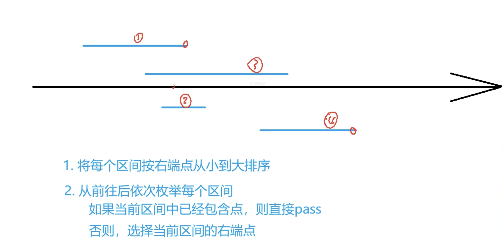
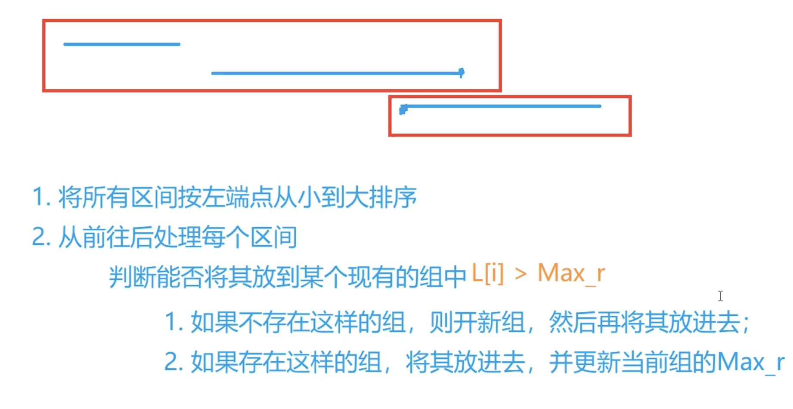
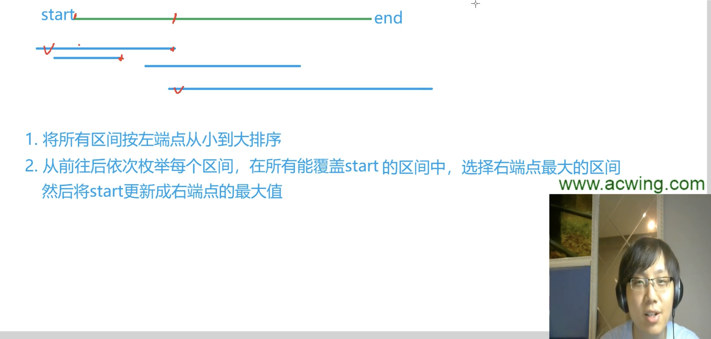
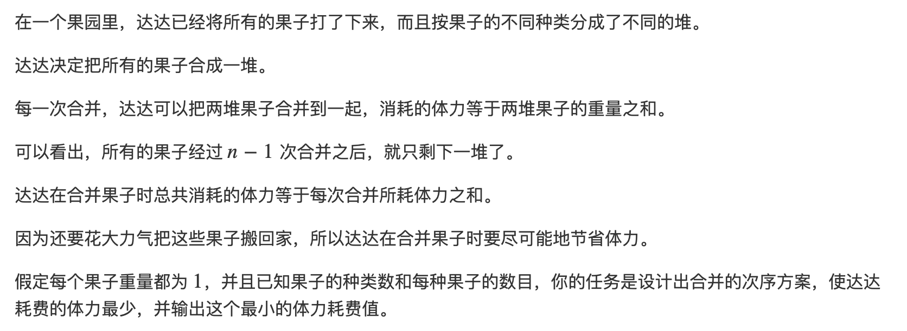
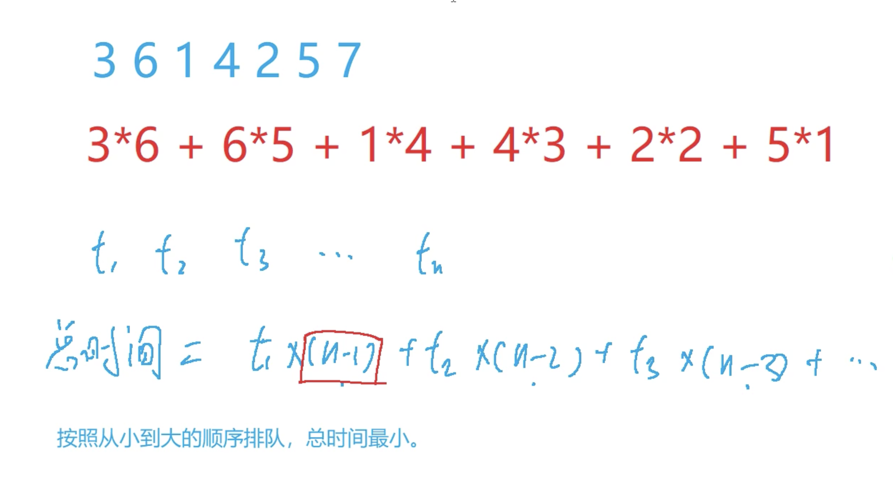
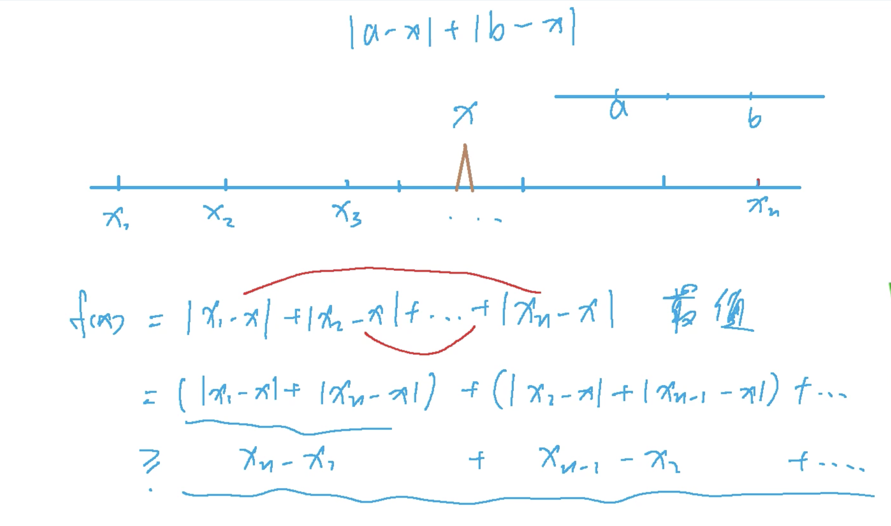
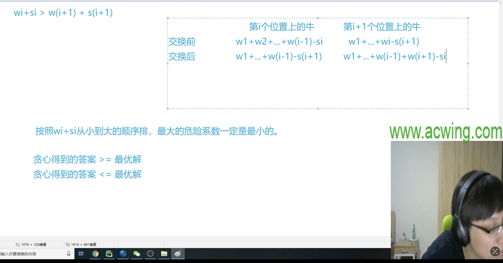
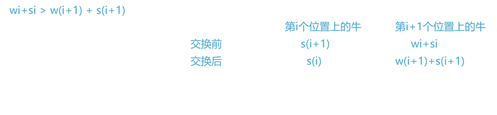

# 区间问题

## 区间选点

题目：

给定 N 个闭区间 [ai,bi]，请你在数轴上选择尽量少的点，使得每个区间内至少包含一个选出的点。

输出选择的点的最小数量。位于区间端点上的点也算作区间内。

**输入格式：**

第一行包含整数 N，表示区间数。

接下来 N 行，每行包含两个整数 ai,bi，表示一个区间的两个端点。

**输出格式：**

输出一个整数，表示所需的点的最小数量。


思路：




代码：

```C++
#include<iostream>
#include<algorithm>

using namespace std;

const int N = 100010;

int n;
//区间
struct Range
{
    int l,r;
    //按照区间右端点比较
    bool operator< (const Range &W)const
    {
        return r < W.r;
    }
}range[N];

int main()
{
    scanf("%d",&n);
    for(int i = 0;i < n; i ++)
    {
        int l,r;
        scanf("%d%d",&l,&r);
        range[i] = {l,r};
    }
    //按区间右端点排序
    sort(range,range + n);
    
    int res = 0,ed = -2e9;//当前选了点的个数，上一个被选择的点坐标（某区间右端点）
    for(int i = 0;i < n;i ++)
    {
        //当前区间的左端点在点的右边，则当前区域没有被覆盖
        if(range[i].l > ed)
        {
            res ++;
            ed = range[i].r;
        }
    }
    
    printf("%d\n",res);
    return 0;
}
```


## 区间分组

题目：

给定 N 个闭区间 [ai,bi]，请你将这些区间分成若干组，使得每组内部的区间两两之间（包括端点）没有交集，并使得组数尽可能小。输出最小组数。

**输入格式：**

第一行包含整数 N，表示区间数。

接下来 N 行，每行包含两个整数 ai,bi，表示一个区间的两个端点。

**输出格式：**

输出一个整数，表示最小组数。


思路：



代码：

```C++
#include<iostream>
#include<algorithm>
#include<queue>

using namespace std;

const int N = 100010;

int n;
struct range
{
    int l,r;
    //按照区间左端点排序
    bool operator< (const range &W) const
    {
        return l < W.l;
    }
}range[N];

int main()
{
    scanf("%d",&n);
    for(int i = 0;i < n;i ++)
    {
        int l,r;
        scanf("%d%d",&l,&r);
        range[i] = {l,r};
    }

    sort(range,range + n);

    priority_queue<int,vector<int>,greater<int>> heap;//用小根堆维护每一个区间组
    //按照区间左端点升序枚举每一个区间，每个区间组记录的是最右端点
    for(int i = 0;i < n;i ++)
    {
        auto r = range[i];//用r表示当前区间
        //每次判断当前所有组的右端点里最小的一个，是不是比当前区间的左端点要小。
        //当前堆为空or堆中最小的右端点都比当前区间左端点大
        //开一个新组，放入当前区间的右端点
        if (heap.empty() || heap.top() >= r.l) heap.push(r.r);
        else//将当前区间加入区间组
        {
            int t = heap.top();
            heap.pop();
            heap.push(r.r);
            //删去原来该区间组最大右端点，放入当前区间的右端点，相当于更新区间最大右端点
        }

    }
    printf("%d\n",heap.size());
    return 0;
}
```


## 区间覆盖

题目：

给定 N 个闭区间 [ai,bi] 以及一个线段区间 [s,t]，请你选择尽量少的区间，将指定线段区间完全覆盖。输出最少区间数，如果无法完全覆盖则输出 −1。

**输入格式：**

第一行包含两个整数 s 和 t，表示给定线段区间的两个端点。

第二行包含整数 N，表示给定区间数。

接下来 N 行，每行包含两个整数 ai,bi，表示一个区间的两个端点。

**输出格式：**

输出一个整数，表示所需最少区间数。

如果无解，则输出 −1。


思路：



代码：

```C++
#include<iostream>
#include<algorithm>

using namespace std;

const int N = 100010;

int n,st,ed;
struct range
{
    int l,r;
    //按区间左端点排序
    bool operator< (const range &W)const
    {
        return l < W.l;
    }
}range[N];

int main()
{
    scanf("%d%d",&st,&ed);//区间左右端点
    scanf("%d",&n);
    
    for(int i = 0;i < n;i ++)
    {
        int l,r;
        scanf("%d%d",&l,&r);
        range[i] = {l,r};
    }
    
    sort(range,range + n);
    
    int res = 0;//区间数
    bool success = false;//是否成功找到解
    //双指针法遍历区间
    for(int i = 0;i < n;i ++)
    {
        int j = i,r = -2e9;//r表示能覆盖start的区间中最大右端点
        while(j < n && range[j].l <= st)
        {
            r = max(r,range[j].r);
            j ++;
        }
        
        res ++;
        
        if(r < st)//最大的右端点都小于起点，则无解
        {
            res = -1;
            break;
        }
        
        if(r >= ed)//最大右端点大于等于终点，则已完成覆盖
        {
            success = true;
            break;
        }
        
        st = r;//更新待覆盖区间起点
        i = j - 1;
        //为了避免重复遍历区间，j循环过的就不用再遍历了，所以i直接跳过去就行了。
        //循环最后会执行i ++。这样减一和加一才能抵消。
        
    }
    
    if(!success) res = -1;
    printf("%d\n",res);
    
    return 0;
}
```

注：

success这个标志用来判断最后一部分是否能覆盖上，不能省略。下面这段代码只能判断中间是否有缺失部分，但不能判断最后是否有缺失部分。

```C++
if (r < st)
{
  res = -1;
  break;
}
```

最后一个区间覆盖不了目标区间的结尾（st ≤ r < ed）时循环依旧可以顺利结束而不被break 。


# Huffman树

## 合并果子

题目：



思路：

优先队列保存权值，每次合并两个最轻的，删除队列中两者权值，并将两者的权值相加的和放入优先队列中。

代码：

```C++
#include<iostream>
#include<algorithm>
#include<queue>

using namespace std;

int main()
{
    int n;
    scanf("%d",&n);
    priority_queue<int,vector<int>,greater<int> > heap;//小根堆
    //读入权值
    while(n--)
    {
        int x;
        scanf("%d",&x);
        heap.push(x);
    }
    
    int res = 0;//合并需要的体力和
    while(heap.size() > 1)
    {
        //取最小两个权值
        int a = heap.top();heap.pop();
        int b = heap.top();heap.pop();
        
        res += a + b;
        
        heap.push(a + b);//合并后将和放入队列
    }
    
    printf("%d\n",res);
    return 0;
}
```


# 排序不等式

## 排队打水

题目：

有 n 个人排队到 1 个水龙头处打水，第 i 个人装满水桶所需的时间是 ti，请问如何安排他们的打水顺序才能使所有人的等待时间之和最小？

**输入格式：**

第一行包含整数 n。

第二行包含 n 个整数，其中第 i 个整数表示第 i 个人装满水桶所花费的时间 ti。

**输出格式：**

输出一个整数，表示最小的等待时间之和。


思路：

队列中只要当前排队的人不是最后一个，则他后面的人的等待时间中都需要加上他打水的时间，根据贪心，应该让打水时间短的人站在前面，保证打水等待的总时间最短



代码：

```C++
#include<iostream>
#include<algorithm>

using namespace std;

typedef long long LL;//最后结果可能会爆int
const int N = 100010;

int n;//人数
int t[N];//每个人打水的时间

int main()
{
    scanf("%d",&n);
    for(int i = 0;i < n;i ++) scanf("%d",&t[i]);
    
    sort(t,t + n);
    
    LL res = 0;
    for(int i = 0;i < n;i ++) res += t[i] * (n - i - 1);
    
    printf("%lld\n",res);
    return 0;
}
```

# 绝对值不等式

## 货仓打水

题目：

在一条数轴上有 N 家商店,它们的坐标分别为 A1∼AN。现在需要在数轴上建立一家货仓,每天清晨,从货仓到每家商店都要运送一车商品。为了提高效率，求把货仓建在何处，可以使得货仓到每家商店的距离之和最小。

**输入格式:**

第一行输入整数 N。

第二行 N 个整数 A1∼AN。

**输出格式:**

输出一个整数，表示距离之和的最小值。


思路：

如果有奇数个点，则放在最中间的一个点上。如果是偶数个点，则放在最中间两个点组成的闭区间上的任意一点，此时不等式可以取到等号



代码：

```C++
#include<iostream>
#include<algorithm>

using namespace std;

const int N = 100010;

int n;
int a[N];

int main()
{
    scanf("%d",&n);
    for(int i = 0;i < n;i ++) scanf("%d",&a[i]);
    
    sort(a,a + n);
    
    int res = 0;
    for(int i = 0;i < n;i ++) res += abs(a[i]-a[n/2]);//每个点与中位点做差取绝对值
    
    printf("%d\n",res);
    
    return 0;
}
```


# 推公式

## 耍杂技的牛

题目：

农民约翰的 N 头奶牛（编号为 1..N）计划逃跑并加入马戏团，为此它们决定练习表演杂技。奶牛们不是非常有创意，只提出了一个杂技表演：叠罗汉，表演时，奶牛们站在彼此的身上，形成一个高高的垂直堆叠。奶牛们正在试图找到自己在这个堆叠中应该所处的位置顺序。这 N 头奶牛中的每一头都有着自己的重量 Wi 以及自己的强壮程度 Si。一头牛支撑不住的可能性取决于它头上所有牛的总重量（不包括它自己）减去它的身体强壮程度的值，现在称该数值为风险值，风险值越大，这只牛撑不住的可能性越高。您的任务是确定奶牛的排序，使得所有奶牛的风险值中的最大值尽可能的小。

**输入格式：**

第一行输入整数 N，表示奶牛数量。

接下来 N 行，每行输入两个整数，表示牛的重量和强壮程度，第 i 行表示第 i 头牛的重量 Wi 以及它的强壮程度 Si。

**输出格式：**

输出一个整数，表示最大风险值的最小可能值。


思路：给定一个牛从上到下的排列顺序使危险系数的最大值最小，危险系数就是该牛上方所有牛的重量减去它的强壮值



交换前后去掉相同的前n-1项，再加上s[i],s[i+1]



交换后的最大值小于交换前的最大值

代码：

```C++
#include<iostream>
#include<algorithm>

using namespace std;

typedef pair<int,int> PII;

const int N = 50010;

int n;
PII cow[N];

int main()
{
    scanf("%d",&n);
    for(int i = 0;i < n;i ++)
    {
        int w,s;
        scanf("%d%d",&w,&s);
        cow[i] = {w + s,w};
    }
    
    sort(cow,cow + n);//按w+s递增排序
    
    int res = -2e9,sum = 0;//res记录最大危险系数，sum记录重量和
    for(int i = 0;i < n;i ++)
    {
        int w = cow[i].second,s = cow[i].first - w;
        res = max(res,sum - s);
        sum += w;//每次加上当前牛的重量即为下一只牛上面所有牛的重量和
    }
    printf("%d",res);
    return 0;
}

```

